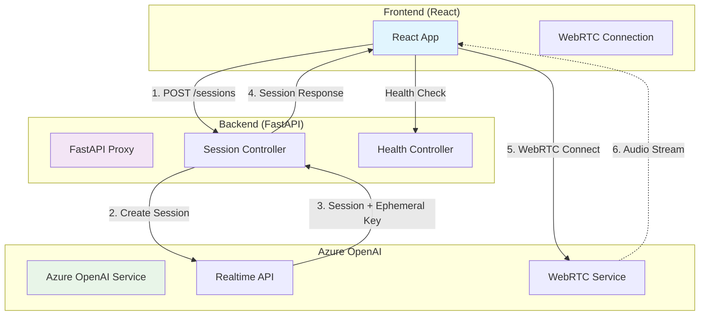
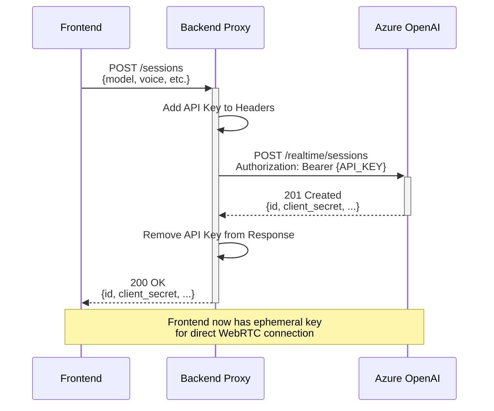
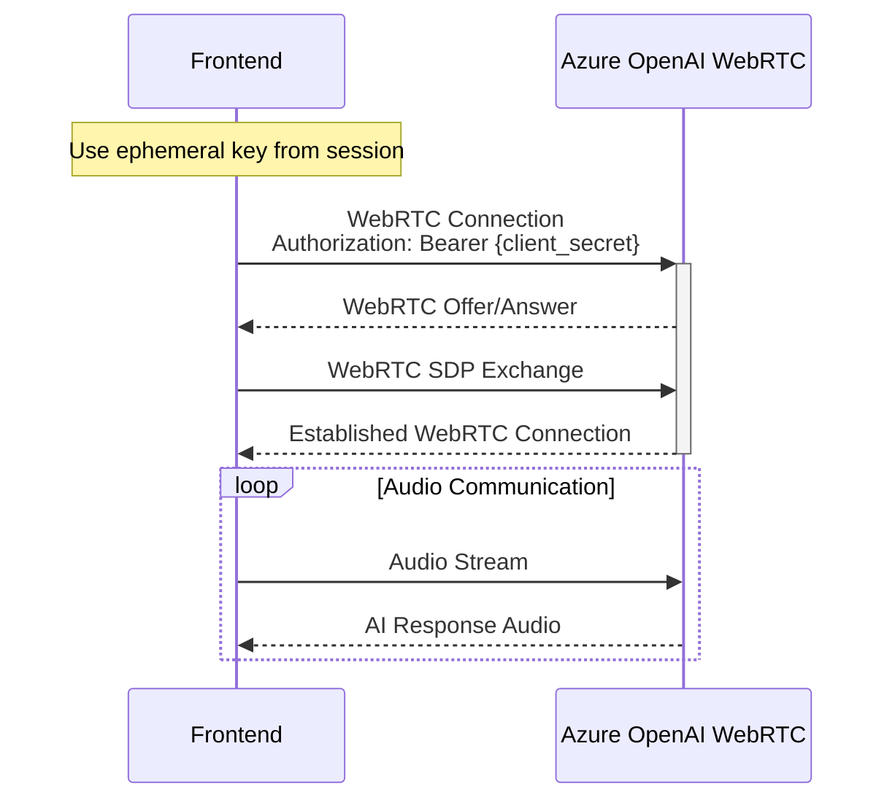
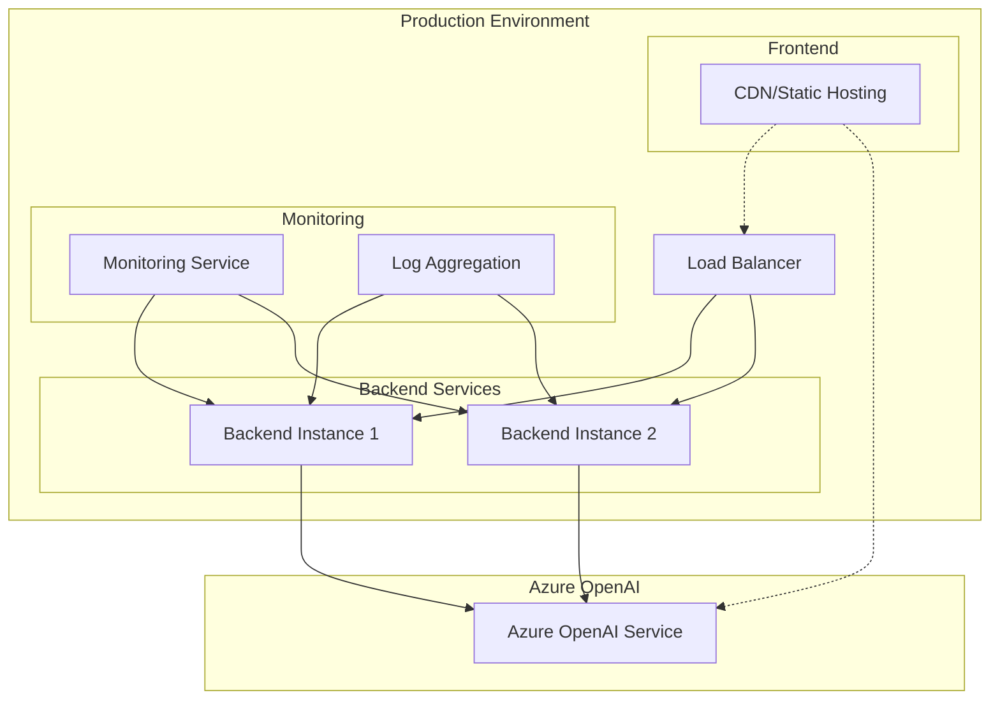

# Azure OpenAI Realtime API Demo

This project demonstrates a secure implementation of Azure OpenAI's Realtime API with WebRTC for audio communication. It consists of a React frontend and a FastAPI backend proxy that securely manages API keys and session creation.

## Architecture Overview

This application uses a secure architecture where the backend acts as a proxy for session creation while the frontend connects directly to Azure OpenAI for WebRTC communication using ephemeral keys.



## Request Flow Details

### 1. Session Creation Flow


### 2. WebRTC Connection Flow


## Security Features

✅ **Secure API Key Management**: API keys are stored only on the backend and never exposed to the frontend  
✅ **Ephemeral Keys**: Frontend uses short-lived ephemeral keys for WebRTC connections  
✅ **CORS Protection**: Backend implements proper CORS policies  
✅ **Request Validation**: All requests are validated and sanitized  
✅ **Error Handling**: Sensitive information is not leaked in error responses

## Environment Setup

This application requires environment variables for both frontend and backend components.

### Backend Environment (.env in backend directory)
```bash
AZURE_OPENAI_API_KEY=your_api_key
AZURE_OPENAI_ENDPOINT=https://your-resource.openai.azure.com
AZURE_OPENAI_API_VERSION=2024-10-01-preview
```

### Frontend Environment (.env in frontend directory)
```bash
REACT_APP_BACKEND_URL=http://localhost:8000
REACT_APP_WEBRTC_URL=https://your-region.openai.azure.com/openai/realtime
REACT_APP_DEPLOYMENT=your_deployment_name
REACT_APP_VOICE=alloy
```

> **Note**: The frontend connects directly to Azure OpenAI for WebRTC using ephemeral keys obtained from the backend. Make sure the WebRTC URL region matches your Azure OpenAI resource region.

## Available Scripts

### Backend (FastAPI)

```bash
# Run backend in development mode
cd backend
./run_dev.sh

# Run backend with Docker
cd backend
./run_docker.sh

# Run tests
cd backend
./test_proxy.sh
```

### Frontend (React)

In the frontend directory, you can run:

#### `npm start`

Runs the app in the development mode.\
Open [http://localhost:3000](http://localhost:3000) to view it in your browser.

The page will reload when you make changes.\
You may also see any lint errors in the console.

#### `npm test`

Launches the test runner in the interactive watch mode.\
See the section about [running tests](https://facebook.github.io/create-react-app/docs/running-tests) for more information.

#### `npm run build`

Builds the app for production to the `build` folder.\
It correctly bundles React in production mode and optimizes the build for the best performance.

The build is minified and the filenames include the hashes.\
Your app is ready to be deployed!

## Features

- Real-time audio communication with Azure OpenAI
- Function calling capabilities
- WebRTC-based communication

## How it Works

### Session Creation Process
1. Frontend sends a session creation request to the backend proxy
2. Backend adds the secure API key and forwards the request to Azure OpenAI
3. Azure OpenAI returns a session with an ephemeral `client_secret`
4. Backend forwards the session response to the frontend (without exposing the main API key)

### WebRTC Communication Process
1. Frontend uses the ephemeral `client_secret` to establish a direct WebRTC connection with Azure OpenAI
2. Audio data is streamed directly between the frontend and Azure OpenAI
3. The data channel is used for exchanging messages and function calls
4. The backend is not involved in the real-time audio communication for optimal performance

### API Endpoints

#### Backend Proxy Endpoints
- `GET /health` - Health check endpoint
- `POST /sessions` - Proxy for Azure OpenAI session creation
- `GET /docs` - OpenAPI documentation

#### Frontend Direct Connections
- WebRTC connection to Azure OpenAI using ephemeral keys

## Functions Available to the AI

- `getPageHTML`: Gets the HTML for the current page
- `changeBackgroundColor`: Changes the background color of the page
- `changeTextColor`: Changes the text color of the page

## Container Deployment

This project can be run using Docker containers for both development and production environments.

### Prerequisites

- Docker and Docker Compose installed
- Azure OpenAI API credentials configured in environment files

### Quick Start

1. **Set up environment variables** (see Environment Setup section above)

2. **Build and run all services**

   ```bash
   # Build and run both frontend and backend
   docker compose up --build

   # Or use the provided script
   ./run_project.sh
   ```

3. **Run backend only** (for development)

   ```bash
   # Start only the backend service
   docker compose up backend

   # Or use the backend script
   cd backend
   ./run_docker.sh
   ```

### Container Management

```bash
# Check running services
docker compose ps

# View logs
docker compose logs -f

# View specific service logs
docker compose logs -f backend
docker compose logs -f frontend

# Stop all services
docker compose down

# Completely remove containers, images, and volumes
docker compose down --rmi all --volumes
```

### Access Services

- **Backend API**: http://localhost:8000
- **API Documentation**: http://localhost:8000/docs
- **Health Check**: http://localhost:8000/health
- **Frontend**: http://localhost:3000 (when enabled in docker-compose)

## Production Deployment Considerations

For a production environment, consider the following:

### Security Enhancements
1. **Environment Variables**: Use secure environment variable management (Azure Key Vault, AWS Secrets Manager, etc.)
2. **Authentication**: Implement proper user authentication and authorization
3. **Rate Limiting**: Add rate limiting to prevent abuse (already implemented in the backend)
4. **HTTPS**: Ensure all connections use HTTPS in production
5. **API Key Rotation**: Implement API key rotation strategies

### Monitoring and Reliability
1. **Logging**: Implement comprehensive logging and monitoring
2. **Error Handling**: Add retry logic and circuit breakers for better reliability
3. **Health Checks**: Use the provided health check endpoints for monitoring
4. **Performance**: Monitor WebRTC connection quality and session management

### Deployment Architecture


## Project Structure

```
realtime-api-webrtc/
├── backend/                    # FastAPI backend proxy
│   ├── src/
│   │   ├── presentation/       # API controllers and middleware
│   │   ├── application/        # Business logic layer
│   │   ├── domain/            # Domain models
│   │   ├── infrastructure/    # External integrations
│   │   └── shared/           # Shared utilities
│   ├── tests/                # Backend tests
│   ├── Dockerfile           # Backend container configuration
│   └── requirements.txt     # Python dependencies
├── frontend/               # React frontend application
│   ├── src/               # React source code
│   ├── public/           # Static assets
│   └── package.json      # Frontend dependencies
├── docs/                 # Project documentation
│   └── specs/           # Technical specifications
└── docker-compose.yml   # Multi-service container setup
```

## Learn More

- **Azure OpenAI Service**: [Official Documentation](https://docs.microsoft.com/en-us/azure/cognitive-services/openai/)
- **Realtime API**: [Azure OpenAI Realtime API Documentation](https://learn.microsoft.com/en-us/azure/ai-services/openai/realtime-audio-quickstart)
- **WebRTC**: [WebRTC Documentation](https://webrtc.org/getting-started/)
- **FastAPI**: [FastAPI Documentation](https://fastapi.tiangolo.com/)
- **React**: [React Documentation](https://reactjs.org/docs/)

This project was bootstrapped with [Create React App](https://github.com/facebook/create-react-app).
