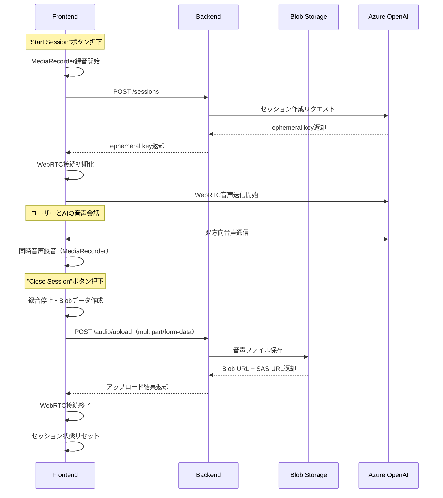

# Azure OpenAI Realtime API プロキシサーバー アーキテクチャ仕様書

## 1. アーキテクチャ概要

### 1.1 設計原則
本プロキシサーバーは、React WebアプリケーションとAzure OpenAI Realtime APIを安全に仲介するSOLID原則に基づいて設計されています：

- **単一責任原則 (SRP)**: 各クラスは単一の責任を持つ（プロキシ処理、認証管理、エラーハンドリングなど）
- **開放閉鎖原則 (OCP)**: 拡張に対して開放的、修正に対して閉鎖的
- **リスコフ置換原則 (LSP)**: 基底クラスは派生クラスで置換可能
- **インターフェース分離原則 (ISP)**: クライアントが使わないインターフェースに依存させない
- **依存性逆転原則 (DIP)**: 高レベルモジュールは低レベルモジュールに依存しない

### 1.2 プロキシサーバーの主要責任
- **APIキー管理**: Azure OpenAI APIキーをサーバーサイドで安全に管理
- **透過的プロキシ**: フロントエンドリクエストのAzure OpenAI APIへの透明な転送
- **音声ファイル管理**: 録音音声のBlobストレージ保存とメタデータ管理
- **セキュリティ**: フロントエンドからのAPIキー隠蔽とセキュア通信
- **エラーハンドリング**: Azure API エラーの適切な処理とレスポンス変換
- **ログ・監視**: プロキシ通信の記録とシステム監視

### 1.3 フロントエンド連携設計
**現在のReact フロントエンド実装に対応**：

```javascript
// フロントエンドの環境変数設定
REACT_APP_SESSIONS_URL=http://localhost:8000/sessions    // セッション作成プロキシ
REACT_APP_WEBRTC_URL=http://localhost:8000/realtime      // WebRTC SDP プロキシ
REACT_APP_AUDIO_UPLOAD_URL=http://localhost:8000/audio/upload  // 音声アップロード
REACT_APP_API_KEY=dummy_key                              // プロキシサーバーで無視
REACT_APP_DEPLOYMENT=gpt-4o-realtime-preview            // AIモデル名
REACT_APP_VOICE=alloy                                    // AI音声タイプ
```

### 1.4 アーキテクチャパターン
- **プロキシパターン**: Azure OpenAI APIへの透過的なプロキシ機能
- **レイヤードアーキテクチャ**: Presentation, Application, Domain, Infrastructure層の分離
- **依存性注入 (DI)**: コンストラクタインジェクションを使用した疎結合設計
- **ファクトリーパターン**: HTTPクライアント・Azure クライアントの生成責任分離
- **アダプターパターン**: Azure OpenAI SDK との統合

### 1.5 運用容易性の追求
- **ログ駆動開発**: 構造化ログによるプロキシ通信の運用監視性
- **ヘルスチェック**: プロキシサーバー・Azure OpenAI接続状態監視
- **メトリクス収集**: プロキシ性能・通信指標の自動収集
- **設定外部化**: 環境変数による環境固有設定（APIキー、エンドポイントなど）
- **エラーハンドリング**: Azure API例外の一元管理と適切なエラーレスポンス

## 2. プロキシサーバー層構造設計

### 2.1 プロキシサーバー構造
```
src/
├── application/           # アプリケーション層
│   ├── services/         # プロキシサービス
│   ├── interfaces/       # アプリケーション層インターフェース
│   └── dto/             # データ転送オブジェクト
├── domain/               # ドメイン層
│   ├── entities/         # エンティティ（セッション、プロキシログなど）
│   ├── models/          # ドメインモデル（音声メタデータなど）
│   ├── value_objects/    # 値オブジェクト
│   ├── services/         # ドメインサービス
│   └── exceptions/       # ドメイン例外
├── infrastructure/       # インフラストラクチャ層
│   ├── azure/           # Azure SDK実装（OpenAI, Blob Storage）
│   ├── storage/         # ストレージクライアント実装
│   ├── configuration/   # 設定管理
│   └── logging/         # ログ実装
├── presentation/         # プレゼンテーション層
│   ├── api/             # プロキシ API エンドポイント
│   │   └── controllers/ # コントローラー（sessions, audio, health）
│   ├── middleware/      # プロキシミドルウェア
│   └── dto/             # API データ転送オブジェクト
└── shared/              # 共通コンポーネント
    ├── security/        # セキュリティ（APIキー管理）
    ├── monitoring/      # メトリクス・ヘルスチェック
    └── utils/           # ユーティリティ
```

### 2.2 プレゼンテーション層 (Presentation Layer)

#### 2.2.1 責任
- HTTPリクエスト/レスポンス処理
- Azure OpenAI APIへのプロキシ処理
- 音声ファイルアップロード・Blobストレージ連携
- リクエスト検証・DTOマッピング
- セキュリティ（APIキー隠蔽）
- エラーハンドリング

#### 2.2.2 主要コンポーネント

```python
# presentation/api/controllers/sessions_proxy_controller.py
from fastapi import APIRouter, HTTPException, Request, Header
from application.interfaces.azure_proxy_service import IAzureProxyService
from presentation.dto.proxy_dto import SessionCreateRequest, SessionCreateResponse

class SessionsProxyController:
    """Azure OpenAI Sessions API プロキシコントローラー"""
    
    def __init__(self, azure_proxy_service: IAzureProxyService):
        self._azure_proxy_service = azure_proxy_service
        self.router = APIRouter(prefix="/sessions", tags=["sessions-proxy"])
        self._setup_routes()
    
    def _setup_routes(self):
        """ルート設定"""
        self.router.add_api_route("/", self.create_session_proxy, methods=["POST"], status_code=201)
    
    async def create_session_proxy(
        self,
        request: SessionCreateRequest,
        api_key: Optional[str] = Header(None, alias="api-key")  # フロントエンドから受信するが無視
    ) -> SessionCreateResponse:
        """Azure OpenAI Sessions API プロキシエンドポイント"""
        try:
            # フロントエンドからのapi-keyヘッダーは無視し、サーバー環境変数を使用
            azure_response = await self._azure_proxy_service.create_session_proxy(request)
            return SessionCreateResponse.from_azure_response(azure_response)
        except Exception as e:
            logger.error(f"Sessions API proxy error: {str(e)}")
            raise HTTPException(status_code=502, detail="Azure OpenAI Sessions API error")

# presentation/api/controllers/realtime_proxy_controller.py
from fastapi import APIRouter, HTTPException, Query, Header, Request
from starlette.responses import Response

class RealtimeProxyController:
    """Azure OpenAI WebRTC API プロキシコントローラー"""
    
    def __init__(self, azure_proxy_service: IAzureProxyService):
        self._azure_proxy_service = azure_proxy_service
        self.router = APIRouter(prefix="/realtime", tags=["realtime-proxy"])
        self._setup_routes()
    
    def _setup_routes(self):
        """ルート設定"""
        self.router.add_api_route("/", self.webrtc_sdp_proxy, methods=["POST"])
    
    async def webrtc_sdp_proxy(
        self,
        request: Request,
        model: str = Query(..., description="AI model name"),
        authorization: str = Header(..., alias="Authorization")
    ) -> Response:
        """Azure OpenAI WebRTC SDP プロキシエンドポイント"""
        try:
            # Bearer tokenからephemeral_keyを抽出
            if not authorization.startswith("Bearer "):
                raise HTTPException(status_code=401, detail="Invalid authorization header format")
            
            ephemeral_key = authorization[7:]  # "Bearer "を除去
            
            # SDP Offer取得
            sdp_offer = await request.body()
            sdp_offer_text = sdp_offer.decode('utf-8')
            
            # Azure OpenAI WebRTC APIにプロキシ
            sdp_answer = await self._azure_proxy_service.webrtc_sdp_proxy(
                model=model, 
                ephemeral_key=ephemeral_key, 
                sdp_offer=sdp_offer_text
            )
            
            return Response(content=sdp_answer, media_type="application/sdp")
            
        except Exception as e:
            logger.error(f"WebRTC API proxy error: {str(e)}")
            raise HTTPException(status_code=502, detail="Azure WebRTC API error")

# presentation/middleware/cors_middleware.py
from fastapi.middleware.cors import CORSMiddleware

def setup_cors_middleware(app: FastAPI, frontend_origins: list[str]):
    """CORS ミドルウェア設定"""
    app.add_middleware(
        CORSMiddleware,
        allow_origins=frontend_origins,  # ["http://localhost:3000"]
        allow_credentials=True,
        allow_methods=["GET", "POST", "PUT", "DELETE"],
        allow_headers=["*"],
    )

# presentation/middleware/logging_middleware.py
import time
from fastapi import Request, Response

async def logging_middleware(request: Request, call_next):
    """リクエストログミドルウェア"""
    start_time = time.time()
    
    # リクエストログ
    logger.info(f"Request: {request.method} {request.url}")
    
    response = await call_next(request)
    
    # レスポンスログ
    process_time = time.time() - start_time
    logger.info(f"Response: {response.status_code} - {process_time:.4f}s")
    
    return response
```

### 2.3 アプリケーション層 (Application Layer)

#### 2.3.1 責任
- Azure OpenAI APIプロキシ処理の調整
- ビジネスロジックの調整
- 外部サービス連携の調整
- エラーハンドリングとリトライ

#### 2.3.2 主要コンポーネント

```python
# application/services/azure_proxy_service.py
from abc import ABC, abstractmethod
from application.dto.azure_dto import AzureSessionRequest, AzureSessionResponse
from infrastructure.azure.azure_openai_client import IAzureOpenAIClient

class IAzureProxyService(ABC):
    """Azure OpenAI プロキシサービスインターフェース"""
    
    @abstractmethod
    async def create_session_proxy(self, request: SessionCreateRequest) -> AzureSessionResponse:
        """セッション作成リクエストをAzure OpenAI APIにプロキシ"""
        pass
    
    @abstractmethod
    async def webrtc_sdp_proxy(self, model: str, ephemeral_key: str, sdp_offer: str) -> str:
        """WebRTC SDP リクエストをAzure OpenAI APIにプロキシ"""
        pass

class AzureProxyService(IAzureProxyService):
    """Azure OpenAI プロキシサービス実装"""
    
    def __init__(self, azure_client: IAzureOpenAIClient, logger: Logger):
        self._azure_client = azure_client
        self._logger = logger
    
    async def create_session_proxy(self, request: SessionCreateRequest) -> AzureSessionResponse:
        """セッション作成プロキシ処理"""
        try:
            self._logger.info(f"Proxying session creation: model={request.model}, voice={request.voice}")
            
            # Azure OpenAI Sessions APIにリクエスト転送
            azure_request = AzureSessionRequest.from_frontend_request(request)
            azure_response = await self._azure_client.create_session(azure_request)
            
            self._logger.info(f"Session created successfully: session_id={azure_response.id}")
            return azure_response
            
        except Exception as e:
            self._logger.error(f"Session creation proxy failed: {str(e)}")
            raise
    
    async def webrtc_sdp_proxy(self, model: str, ephemeral_key: str, sdp_offer: str) -> str:
        """WebRTC SDP プロキシ処理"""
        try:
            self._logger.info(f"Proxying WebRTC SDP: model={model}")
            
            # Azure OpenAI WebRTC APIにSDP Offer転送
            sdp_answer = await self._azure_client.exchange_sdp(
                model=model,
                ephemeral_key=ephemeral_key,
                sdp_offer=sdp_offer
            )
            
            self._logger.info("WebRTC SDP exchange successful")
            return sdp_answer
            
        except Exception as e:
            self._logger.error(f"WebRTC SDP proxy failed: {str(e)}")
            raise
```
    
    @abstractmethod
    async def create_session_proxy(self, request: SessionCreateRequest) -> AzureSessionResponse:
        pass
    
    @abstractmethod
    async def webrtc_sdp_proxy(self, model: str, ephemeral_key: str, sdp_offer: str) -> str:
        pass

class AzureProxyService(IAzureProxyService):
    """Azure OpenAI プロキシサービス実装"""
    
    def __init__(self,
                 azure_client: IAzureOpenAIClient,
                 audio_service: IAudioService,
                 logger: ILogger):
        self._azure_client = azure_client
        self._audio_service = audio_service
        self._logger = logger
    
    async def create_session_proxy(self, request: SessionCreateRequest) -> AzureSessionResponse:
        """Azure OpenAI Sessions API プロキシ処理"""
        try:
            # フロントエンドリクエストをAzure OpenAI用に変換
            azure_request = AzureSessionRequest(
                model=request.model,
                voice=request.voice,
                # デフォルトの指示とツール設定を追加
                instructions="あなたはとても優秀なAIアシスタントです。会話内容に対して、非常にナチュラルな返事をします。",
                modalities=["text", "audio"],
                tools=[
                    {
                        "type": "function",
                        "name": "changeBackgroundColor",
                        "description": "Changes the background color of a web page",
                        "parameters": {
                            "type": "object",
                            "properties": {
                                "color": {"type": "string", "description": "A hex value of the color"}
                            },
                            "required": ["color"]
                        }
                    },
                    {
                        "type": "function",
                        "name": "getPageHTML",
                        "description": "Gets the HTML for the current page"
                    },
                    {
                        "type": "function",
                        "name": "changeTextColor",
                        "description": "Changes the text color of a web page",
                        "parameters": {
                            "type": "object",
                            "properties": {
                                "color": {"type": "string", "description": "A hex value of the color"}
                            },
                            "required": ["color"]
                        }
                    }
                ]
            )
            
            # Azure OpenAI Sessions APIを呼び出し
            azure_response = await self._azure_client.create_session(azure_request)
            
            self._logger.info(f"Azure session created successfully: {azure_response.id}")
            return azure_response
            
        except Exception as e:
            self._logger.error(f"Failed to proxy session creation: {str(e)}")
            raise
    
    async def webrtc_sdp_proxy(self, model: str, ephemeral_key: str, sdp_offer: str) -> str:
        """Azure OpenAI WebRTC SDP プロキシ処理"""
        try:
            # Azure OpenAI WebRTC APIにSDP Offerを転送
            sdp_answer = await self._azure_client.exchange_sdp(model, ephemeral_key, sdp_offer)
            
            self._logger.info(f"SDP exchange completed for model: {model}")
            return sdp_answer
            
        except Exception as e:
            self._logger.error(f"Failed to proxy SDP exchange: {str(e)}")
            raise

# application/services/audio_service.py
class IAudioService(ABC):
    """音声管理サービスインターフェース"""
    
    @abstractmethod
    async def save_audio_from_webrtc(self, session_id: str, audio_data: bytes, metadata: AudioMetadata) -> AudioRecord:
        pass
    
    @abstractmethod
    async def get_session_audio_files(self, session_id: str, audio_type: Optional[str] = None, 
                                     limit: int = 50, offset: int = 0) -> SessionAudioResult:
        pass

class AudioService(IAudioService):
    """音声管理アプリケーションサービス"""
    
    def __init__(self,
                 audio_repository: IAudioRepository,
                 blob_storage: IBlobStorage,
                 audio_processor: IAudioProcessor):
        self._audio_repository = audio_repository
        self._blob_storage = blob_storage
        self._audio_processor = audio_processor
    
    async def save_audio_from_webrtc(self, session_id: str, audio_data: bytes, metadata: AudioMetadata) -> AudioRecord:
        """WebRTCから取得した音声データ保存"""
        # 音声データ処理（WebRTC Opus形式 → 保存用形式変換）
        processed_audio = await self._audio_processor.process_webrtc_audio(audio_data, metadata)
        
        # Azure Blob Storage保存
        blob_url = await self._blob_storage.upload(processed_audio)
        
        # メタデータ作成・永続化
        audio_record = AudioRecord.create(
            session_id=session_id,
            blob_url=blob_url,
            metadata=processed_audio.metadata
        )
        
        await self._audio_repository.save(audio_record)
        return audio_record
    
    async def get_session_audio_files(self, session_id: str, audio_type: Optional[str] = None, 
                                     limit: int = 50, offset: int = 0) -> SessionAudioResult:
        """セッション音声ファイル一覧取得"""
        audio_files = await self._audio_repository.get_by_session(
            session_id=session_id,
            audio_type=audio_type,
            limit=limit,
            offset=offset
        )
        
        # 統計情報計算
        summary = await self._audio_repository.get_session_summary(session_id)
        
        return SessionAudioResult(
            session_id=session_id,
            summary=summary,
            audio_files=audio_files,
            pagination=Pagination(limit=limit, offset=offset, has_more=len(audio_files) == limit)
        )
```

### 2.4 ドメイン層 (Domain Layer)

#### 2.4.1 責任
- 核となるビジネスロジック
- ドメインルールの実装
- エンティティ・値オブジェクトの定義
- ドメインサービス

#### 2.4.2 主要コンポーネント

```python
# domain/entities/session.py
from dataclasses import dataclass, field
from datetime import datetime, timedelta
from typing import Optional
from domain.value_objects.session_id import SessionId
from domain.value_objects.ephemeral_key import EphemeralKey
from domain.exceptions.domain_exceptions import InvalidSessionStateException

@dataclass
class Session:
    """セッションエンティティ"""
    
    session_id: SessionId
    ephemeral_key: EphemeralKey
    user_id: str
    model: str
    voice: str
    status: str = "active"
    created_at: datetime = field(default_factory=datetime.utcnow)
    expires_at: datetime = field(default_factory=lambda: datetime.utcnow() + timedelta(hours=1))
    connection_state: str = "disconnected"
    audio_files_count: int = 0
    total_duration: float = 0.0
    last_activity: Optional[datetime] = None
    
    def __post_init__(self):
        """エンティティ不変条件チェック"""
        if self.expires_at <= self.created_at:
            raise InvalidSessionStateException("Expiration time must be after creation time")
    
    def is_expired(self) -> bool:
        """有効期限チェック"""
        return datetime.utcnow() > self.expires_at
    
    def is_active(self) -> bool:
        """アクティブ状態チェック"""
        return self.status == "active" and not self.is_expired()
    
    def connect(self) -> None:
        """接続状態更新"""
        if not self.is_active():
            raise InvalidSessionStateException("Cannot connect inactive session")
        self.connection_state = "connected"
        self.last_activity = datetime.utcnow()
    
    def disconnect(self) -> None:
        """切断状態更新"""
        self.connection_state = "disconnected"
        self.last_activity = datetime.utcnow()
    
    def terminate(self) -> None:
        """セッション終了"""
        self.status = "terminated"
        self.connection_state = "disconnected"
        self.last_activity = datetime.utcnow()
    
    def add_audio_file(self, duration: float) -> None:
        """音声ファイル追加"""
        self.audio_files_count += 1
        self.total_duration += duration
        self.last_activity = datetime.utcnow()

# domain/entities/audio_record.py
@dataclass
class AudioRecord:
    """音声記録エンティティ"""
    
    audio_id: str
    session_id: SessionId
    audio_type: str  # user_speech, ai_response, full_conversation
    blob_url: str
    size_bytes: int
    metadata: AudioMetadata
    created_at: datetime = field(default_factory=datetime.utcnow)
    last_accessed: Optional[datetime] = None
    
    @classmethod
    def create(cls, session_id: SessionId, blob_url: str, metadata: AudioMetadata) -> 'AudioRecord':
        """音声記録作成ファクトリーメソッド"""
        import uuid
        return cls(
            audio_id=str(uuid.uuid4()),
            session_id=session_id,
            audio_type=metadata.speaker_type,
            blob_url=blob_url,
            size_bytes=metadata.size_bytes,
            metadata=metadata
        )
    
    def access(self) -> None:
        """アクセス記録更新"""
        self.last_accessed = datetime.utcnow()

# domain/value_objects/audio_metadata.py
@dataclass(frozen=True)
class AudioMetadata:
    """音声メタデータ値オブジェクト"""
    
    duration: float
    format: str
    sample_rate: int
    channels: int
    speaker_type: str  # user, assistant
    timestamp_start: datetime
    timestamp_end: datetime
    confidence_score: float
    language: str
    transcription: Optional[str] = None
    size_bytes: int = 0
    
    def __post_init__(self):
        """値オブジェクト不変条件チェック"""
        if self.duration <= 0:
            raise ValueError("Duration must be positive")
        if self.confidence_score < 0 or self.confidence_score > 1:
            raise ValueError("Confidence score must be between 0 and 1")
        if self.timestamp_end <= self.timestamp_start:
            raise ValueError("End timestamp must be after start timestamp")

# domain/services/session_domain_service.py
class SessionDomainService:
    """セッションドメインサービス"""
    
    def __init__(self, session_repository: ISessionRepository):
        self._session_repository = session_repository
    
    def create_session(self, azure_session_id: str, ephemeral_key: str, 
                      user_id: str, model: str, voice: str) -> Session:
        """セッション作成ドメインロジック"""
        session_id = SessionId.generate()
        ephemeral_key_vo = EphemeralKey(ephemeral_key)
        
        return Session(
            session_id=session_id,
            ephemeral_key=ephemeral_key_vo,
            user_id=user_id,
            model=model,
            voice=voice
        )
    
    async def can_create_new_session(self, user_id: str) -> bool:
        """ユーザーの新規セッション作成可否チェック"""
        active_sessions = await self._session_repository.get_active_sessions_by_user(user_id)
        return len(active_sessions) < 5  # 最大5セッション
```

### 2.5 インフラストラクチャ層 (Infrastructure Layer)

#### 2.5.1 責任
- 外部システム連携
- データ永続化
- 設定管理
- 技術的実装詳細

#### 2.5.2 主要コンポーネント

```python
# infrastructure/persistence/repositories/session_repository.py
from typing import List, Optional
from sqlalchemy.ext.asyncio import AsyncSession
from domain.entities.session import Session
from domain.repositories.session_repository import ISessionRepository
from infrastructure.persistence.models.session_model import SessionModel

class SessionRepository(ISessionRepository):
    """セッションリポジトリ実装"""
    
    def __init__(self, db_session: AsyncSession):
        self._db_session = db_session
    
    async def save(self, session: Session) -> None:
        """セッション保存"""
        model = SessionModel.from_entity(session)
        self._db_session.add(model)
        await self._db_session.commit()
    
    async def get_by_id(self, session_id: str) -> Optional[Session]:
        """ID指定取得"""
        result = await self._db_session.execute(
            select(SessionModel).where(SessionModel.session_id == session_id)
        )
        model = result.scalar_one_or_none()
        return model.to_entity() if model else None
    
    async def get_active_sessions_by_user(self, user_id: str) -> List[Session]:
        """ユーザーのアクティブセッション取得"""
        result = await self._db_session.execute(
            select(SessionModel)
            .where(SessionModel.user_id == user_id)
            .where(SessionModel.status == "active")
            .where(SessionModel.expires_at > datetime.utcnow())
        )
        models = result.scalars().all()
        return [model.to_entity() for model in models]

# infrastructure/external/azure_openai_client.py
from abc import ABC, abstractmethod
import aiohttp
from application.dto.azure_requests import AzureSessionRequest, AzureSessionResponse

class IAzureOpenAIClient(ABC):
    """Azure OpenAI クライアントインターフェース"""
    
    @abstractmethod
    async def create_session(self, request: AzureSessionRequest) -> AzureSessionResponse:
        pass
    
    @abstractmethod
    async def connect_websocket(self, ephemeral_key: str) -> Any:
        pass

class AzureOpenAIClient(IAzureOpenAIClient):
    """Azure OpenAI クライアント実装"""
    
    def __init__(self, endpoint: str, api_key: str, logger: ILogger):
        self._endpoint = endpoint
        self._api_key = api_key
        self._logger = logger
    
    async def create_session(self, request: AzureSessionRequest) -> AzureSessionResponse:
        """セッション作成API呼び出し"""
        async with aiohttp.ClientSession() as session:
            async with session.post(
                f"{self._endpoint}/realtime/sessions",
                headers={
                    "api-key": self._api_key,
                    "Content-Type": "application/json"
                },
                json=request.to_dict()
            ) as response:
                if response.status != 201:
                    self._logger.error(f"Azure OpenAI session creation failed: {response.status}")
                    raise ExternalServiceException(f"Failed to create Azure session: {response.status}")
                
                data = await response.json()
                return AzureSessionResponse.from_dict(data)

# infrastructure/storage/blob_storage.py
class IBlobStorage(ABC):
    """Blob Storage インターフェース"""
    
    @abstractmethod
    async def upload(self, audio_data: ProcessedAudio) -> str:
        pass
    
    @abstractmethod
    async def generate_sas_url(self, blob_url: str, expires_in_hours: int = 1) -> str:
        pass

class AzureBlobStorage(IBlobStorage):
    """Azure Blob Storage 実装"""
    
    def __init__(self, connection_string: str, container_name: str):
        self._blob_service_client = BlobServiceClient.from_connection_string(connection_string)
        self._container_name = container_name
    
    async def upload(self, audio_data: ProcessedAudio) -> str:
        """音声データアップロード"""
        blob_name = self._generate_blob_name(audio_data)
        blob_client = self._blob_service_client.get_blob_client(
            container=self._container_name,
            blob=blob_name
        )
        
        await blob_client.upload_blob(
            audio_data.data,
            blob_type=BlobType.BlockBlob,
            overwrite=True,
            metadata=audio_data.metadata.to_dict()
        )
        
        return blob_client.url
    
    def _generate_blob_name(self, audio_data: ProcessedAudio) -> str:
        """Blobパス生成"""
        timestamp = audio_data.metadata.timestamp_start
        return f"{audio_data.metadata.speaker_type}/{timestamp.year:04d}/{timestamp.month:02d}/{timestamp.day:02d}/{audio_data.session_id}/{audio_data.audio_id}.{audio_data.metadata.format}"
```

## 3. 依存性注入設計

### 3.1 DIコンテナ設定

```python
# infrastructure/configuration/di_container.py
from dependency_injector import containers, providers
from dependency_injector.wiring import Provide
import asyncpg
from sqlalchemy.ext.asyncio import create_async_engine, AsyncSession

class ApplicationContainer(containers.DeclarativeContainer):
    """DIコンテナ"""
    
    # 設定
    config = providers.Configuration()
    
    # データベース
    database_engine = providers.Singleton(
        create_async_engine,
        config.database.url,
        echo=config.database.echo,
        pool_size=config.database.pool_size,
        max_overflow=config.database.max_overflow
    )
    
    database_session_factory = providers.Factory(
        AsyncSession,
        bind=database_engine
    )
    
    # ログ
    logger = providers.Singleton(
        StructuredLogger,
        level=config.logging.level,
        format=config.logging.format
    )
    
    # 外部サービス
    azure_openai_client = providers.Singleton(
        AzureOpenAIClient,
        endpoint=config.azure.openai.endpoint,
        api_key=config.azure.openai.api_key,
        logger=logger
    )
    
    blob_storage = providers.Singleton(
        AzureBlobStorage,
        connection_string=config.azure.storage.connection_string,
        container_name=config.azure.storage.container_name
    )
    
    # リポジトリ
    session_repository = providers.Factory(
        SessionRepository,
        db_session=database_session_factory
    )
    
    audio_repository = providers.Factory(
        AudioRepository,
        db_session=database_session_factory
    )
    
    # ドメインサービス
    session_domain_service = providers.Factory(
        SessionDomainService,
        session_repository=session_repository
    )
    
    # アプリケーションサービス
    session_service = providers.Factory(
        SessionService,
        session_repository=session_repository,
        session_domain_service=session_domain_service,
        azure_client=azure_openai_client,
        logger=logger
    )
    
    audio_service = providers.Factory(
        AudioService,
        audio_repository=audio_repository,
        blob_storage=blob_storage,
        audio_processor=providers.Factory(AudioProcessor),
    )
    
    # コントローラー
    session_controller = providers.Factory(
        SessionController,
        session_service=session_service
    )
    
    # WebSocketハンドラー
    realtime_handler = providers.Factory(
        RealtimeWebSocketHandler,
        session_service=session_service,
        message_proxy=providers.Factory(MessageProxy),
        audio_service=audio_service
    )

# main.py
async def create_app() -> FastAPI:
    """アプリケーション初期化"""
    # DIコンテナ設定
    container = ApplicationContainer()
    container.config.from_yaml("config.yaml")
    container.wire(modules=[
        "presentation.api.controllers",
        "presentation.websocket",
        "application.services"
    ])
    
    app = FastAPI(title="Realtime API WebRTC Backend")
    
    # ルーター登録
    session_controller = container.session_controller()
    app.include_router(session_controller.router)
    
    # WebSocketルート登録
    realtime_handler = container.realtime_handler()
    app.websocket("/api/v1/realtime/webrtc/{session_id}")(realtime_handler.handle_connection)
    
    return app
```

### 3.2 設定管理

```python
# infrastructure/configuration/settings.py
from pydantic import BaseSettings, Field
from typing import Optional

class DatabaseSettings(BaseSettings):
    """データベース設定"""
    url: str = Field(..., env="DATABASE_URL")
    echo: bool = Field(False, env="DATABASE_ECHO")
    pool_size: int = Field(10, env="DATABASE_POOL_SIZE")
    max_overflow: int = Field(20, env="DATABASE_MAX_OVERFLOW")

class AzureSettings(BaseSettings):
    """Azure設定"""
    openai_endpoint: str = Field(..., env="AZURE_OPENAI_ENDPOINT")
    openai_api_key: str = Field(..., env="AZURE_OPENAI_API_KEY")
    storage_connection_string: str = Field(..., env="AZURE_STORAGE_CONNECTION_STRING")
    storage_container_name: str = Field("audio-records", env="AZURE_STORAGE_CONTAINER_NAME")

class LoggingSettings(BaseSettings):
    """ログ設定"""
    level: str = Field("INFO", env="LOG_LEVEL")
    format: str = Field("json", env="LOG_FORMAT")

class ApplicationSettings(BaseSettings):
    """アプリケーション設定"""
    database: DatabaseSettings = DatabaseSettings()
    azure: AzureSettings = AzureSettings()
    logging: LoggingSettings = LoggingSettings()
    
    class Config:
        env_file = ".env"
        env_nested_delimiter = "__"
```

## 4. 運用監視設計

### 4.1 ログ管理

```python
# shared/logging/structured_logger.py
import structlog
import logging
from typing import Any, Dict
from datetime import datetime

class StructuredLogger:
    """構造化ログ管理"""
    
    def __init__(self, level: str = "INFO", format: str = "json"):
        self._logger = structlog.get_logger()
        self._setup_logging(level, format)
    
    def _setup_logging(self, level: str, format: str):
        """ログ設定初期化"""
        logging.basicConfig(
            format="%(message)s",
            stream=sys.stdout,
            level=getattr(logging, level.upper())
        )
        
        processors = [
            structlog.stdlib.filter_by_level,
            structlog.stdlib.add_logger_name,
            structlog.stdlib.add_log_level,
            structlog.stdlib.PositionalArgumentsFormatter(),
            structlog.processors.TimeStamper(fmt="iso"),
            structlog.processors.StackInfoRenderer(),
            structlog.processors.format_exc_info,
        ]
        
        if format == "json":
            processors.append(structlog.processors.JSONRenderer())
        else:
            processors.append(structlog.dev.ConsoleRenderer())
        
        structlog.configure(
            processors=processors,
            context_class=dict,
            logger_factory=structlog.stdlib.LoggerFactory(),
            wrapper_class=structlog.stdlib.BoundLogger,
            cache_logger_on_first_use=True,
        )
    
    def info(self, message: str, **kwargs):
        """情報ログ"""
        self._logger.info(message, **kwargs)
    
    def error(self, message: str, **kwargs):
        """エラーログ"""
        self._logger.error(message, **kwargs)
    
    def warning(self, message: str, **kwargs):
        """警告ログ"""
        self._logger.warning(message, **kwargs)
    
    def debug(self, message: str, **kwargs):
        """デバッグログ"""
        self._logger.debug(message, **kwargs)
```

### 4.2 ヘルスチェック

```python
# shared/monitoring/health_checker.py
from abc import ABC, abstractmethod
from enum import Enum
from dataclasses import dataclass
from typing import Dict, List
import asyncio

class HealthStatus(Enum):
    HEALTHY = "healthy"
    UNHEALTHY = "unhealthy"
    DEGRADED = "degraded"

@dataclass
class HealthCheckResult:
    """ヘルスチェック結果"""
    name: str
    status: HealthStatus
    message: str
    response_time_ms: float
    details: Dict[str, Any] = None

class IHealthCheck(ABC):
    """ヘルスチェックインターフェース"""
    
    @abstractmethod
    async def check(self) -> HealthCheckResult:
        pass

class DatabaseHealthCheck(IHealthCheck):
    """データベースヘルスチェック"""
    
    def __init__(self, session_factory):
        self._session_factory = session_factory
    
    async def check(self) -> HealthCheckResult:
        """データベース接続チェック"""
        start_time = time.time()
        try:
            async with self._session_factory() as session:
                await session.execute(text("SELECT 1"))
            
            response_time = (time.time() - start_time) * 1000
            return HealthCheckResult(
                name="database",
                status=HealthStatus.HEALTHY,
                message="Database connection successful",
                response_time_ms=response_time
            )
        except Exception as e:
            response_time = (time.time() - start_time) * 1000
            return HealthCheckResult(
                name="database",
                status=HealthStatus.UNHEALTHY,
                message=f"Database connection failed: {str(e)}",
                response_time_ms=response_time
            )

class AzureOpenAIHealthCheck(IHealthCheck):
    """Azure OpenAI ヘルスチェック"""
    
    def __init__(self, azure_client: IAzureOpenAIClient):
        self._azure_client = azure_client
    
    async def check(self) -> HealthCheckResult:
        """Azure OpenAI 接続チェック"""
        start_time = time.time()
        try:
            # 簡単なヘルスチェック呼び出し
            await self._azure_client.health_check()
            
            response_time = (time.time() - start_time) * 1000
            return HealthCheckResult(
                name="azure_openai",
                status=HealthStatus.HEALTHY,
                message="Azure OpenAI connection successful",
                response_time_ms=response_time
            )
        except Exception as e:
            response_time = (time.time() - start_time) * 1000
            return HealthCheckResult(
                name="azure_openai",
                status=HealthStatus.UNHEALTHY,
                message=f"Azure OpenAI connection failed: {str(e)}",
                response_time_ms=response_time
            )

class HealthCheckService:
    """ヘルスチェック管理サービス"""
    
    def __init__(self, health_checks: List[IHealthCheck]):
        self._health_checks = health_checks
    
    async def check_all(self) -> Dict[str, Any]:
        """全ヘルスチェック実行"""
        results = await asyncio.gather(
            *[check.check() for check in self._health_checks],
            return_exceptions=True
        )
        
        overall_status = HealthStatus.HEALTHY
        check_results = {}
        
        for result in results:
            if isinstance(result, Exception):
                overall_status = HealthStatus.UNHEALTHY
                continue
            
            check_results[result.name] = {
                "status": result.status.value,
                "message": result.message,
                "response_time_ms": result.response_time_ms,
                "details": result.details
            }
            
            if result.status == HealthStatus.UNHEALTHY:
                overall_status = HealthStatus.UNHEALTHY
            elif result.status == HealthStatus.DEGRADED and overall_status == HealthStatus.HEALTHY:
                overall_status = HealthStatus.DEGRADED
        
        return {
            "status": overall_status.value,
            "timestamp": datetime.utcnow().isoformat(),
            "checks": check_results
        }

# presentation/api/controllers/health_controller.py
class HealthController:
    """ヘルスチェックコントローラー"""
    
    def __init__(self, health_check_service: HealthCheckService):
        self._health_check_service = health_check_service
        self.router = APIRouter(prefix="/health", tags=["health"])
        self._setup_routes()
    
    def _setup_routes(self):
        self.router.add_api_route("/", self.health_check, methods=["GET"])
    
    async def health_check(self) -> Dict[str, Any]:
        """ヘルスチェックエンドポイント"""
        result = await self._health_check_service.check_all()
        
        if result["status"] == "unhealthy":
            raise HTTPException(status_code=503, detail=result)
        elif result["status"] == "degraded":
            return JSONResponse(status_code=200, content=result)
        else:
            return result
```

### 4.3 メトリクス収集

```python
# shared/monitoring/metrics_collector.py
from prometheus_client import Counter, Histogram, Gauge, start_http_server
import time
from functools import wraps

class MetricsCollector:
    """メトリクス収集管理"""
    
    def __init__(self):
        # カウンタメトリクス
        self.session_created_total = Counter(
            'sessions_created_total',
            'Total number of sessions created',
            ['user_id', 'model']
        )
        
        self.audio_files_saved_total = Counter(
            'audio_files_saved_total',
            'Total number of audio files saved',
            ['session_id', 'audio_type']
        )
        
        self.api_requests_total = Counter(
            'api_requests_total',
            'Total number of API requests',
            ['method', 'endpoint', 'status_code']
        )
        
        # ヒストグラムメトリクス
        self.request_duration = Histogram(
            'request_duration_seconds',
            'Request duration in seconds',
            ['method', 'endpoint']
        )
        
        self.audio_processing_duration = Histogram(
            'audio_processing_duration_seconds',
            'Audio processing duration in seconds',
            ['audio_type']
        )
        
        # ゲージメトリクス
        self.active_sessions = Gauge(
            'active_sessions_count',
            'Number of active sessions'
        )
        
        self.websocket_connections = Gauge(
            'websocket_connections_count',
            'Number of active WebSocket connections'
        )
    
    def track_request_duration(self, method: str, endpoint: str):
        """リクエスト時間計測デコレータ"""
        def decorator(func):
            @wraps(func)
            async def wrapper(*args, **kwargs):
                start_time = time.time()
                try:
                    result = await func(*args, **kwargs)
                    status_code = getattr(result, 'status_code', 200)
                    return result
                except Exception as e:
                    status_code = getattr(e, 'status_code', 500)
                    raise
                finally:
                    duration = time.time() - start_time
                    self.request_duration.labels(
                        method=method, 
                        endpoint=endpoint
                    ).observe(duration)
                    self.api_requests_total.labels(
                        method=method,
                        endpoint=endpoint,
                        status_code=status_code
                    ).inc()
            return wrapper
        return decorator
    
    def increment_session_created(self, user_id: str, model: str):
        """セッション作成カウンタ増加"""
        self.session_created_total.labels(user_id=user_id, model=model).inc()
    
    def increment_audio_saved(self, session_id: str, audio_type: str):
        """音声保存カウンタ増加"""
        self.audio_files_saved_total.labels(
            session_id=session_id,
            audio_type=audio_type
        ).inc()
    
    def set_active_sessions(self, count: int):
        """アクティブセッション数設定"""
        self.active_sessions.set(count)
    
    def increment_websocket_connections(self):
        """WebSocket接続数増加"""
        self.websocket_connections.inc()
    
    def decrement_websocket_connections(self):
        """WebSocket接続数減少"""
        self.websocket_connections.dec()

# メトリクス用ミドルウェア
class MetricsMiddleware:
    """メトリクス収集ミドルウェア"""
    
    def __init__(self, app: FastAPI, metrics: MetricsCollector):
        self.app = app
        self.metrics = metrics
    
    async def __call__(self, scope, receive, send):
        if scope["type"] == "http":
            start_time = time.time()
            
            async def send_wrapper(message):
                if message["type"] == "http.response.start":
                    status_code = message["status"]
                    duration = time.time() - start_time
                    
                    self.metrics.request_duration.labels(
                        method=scope["method"],
                        endpoint=scope["path"]
                    ).observe(duration)
                    
                    self.metrics.api_requests_total.labels(
                        method=scope["method"],
                        endpoint=scope["path"],
                        status_code=status_code
                    ).inc()
                
                await send(message)
            
            await self.app(scope, receive, send_wrapper)
        else:
            await self.app(scope, receive, send)
```

## 5. テスト戦略

### 5.1 テスト構成

```python
# tests/unit/domain/test_session.py
import pytest
from datetime import datetime, timedelta
from domain.entities.session import Session
from domain.value_objects.session_id import SessionId
from domain.value_objects.ephemeral_key import EphemeralKey
from domain.exceptions.domain_exceptions import InvalidSessionStateException

class TestSession:
    """セッションエンティティ単体テスト"""
    
    def test_create_valid_session(self):
        """有効なセッション作成テスト"""
        session = Session(
            session_id=SessionId.generate(),
            ephemeral_key=EphemeralKey("test-key"),
            user_id="user123",
            model="gpt-4o-realtime-preview",
            voice="alloy"
        )
        
        assert session.is_active()
        assert not session.is_expired()
        assert session.status == "active"
    
    def test_session_expiration(self):
        """セッション有効期限テスト"""
        session = Session(
            session_id=SessionId.generate(),
            ephemeral_key=EphemeralKey("test-key"),
            user_id="user123",
            model="gpt-4o-realtime-preview",
            voice="alloy",
            expires_at=datetime.utcnow() - timedelta(seconds=1)
        )
        
        assert session.is_expired()
        assert not session.is_active()
    
    def test_invalid_expiration_time(self):
        """無効な有効期限テスト"""
        with pytest.raises(InvalidSessionStateException):
            Session(
                session_id=SessionId.generate(),
                ephemeral_key=EphemeralKey("test-key"),
                user_id="user123",
                model="gpt-4o-realtime-preview",
                voice="alloy",
                expires_at=datetime.utcnow() - timedelta(hours=1)
            )

# tests/integration/test_session_service.py
import pytest
from unittest.mock import AsyncMock, Mock
from application.services.session_service import SessionService
from domain.entities.session import Session

@pytest.mark.asyncio
class TestSessionServiceIntegration:
    """セッションサービス統合テスト"""
    
    @pytest.fixture
    def session_service(self):
        session_repository = AsyncMock()
        session_domain_service = Mock()
        azure_client = AsyncMock()
        logger = Mock()
        
        return SessionService(
            session_repository=session_repository,
            session_domain_service=session_domain_service,
            azure_client=azure_client,
            logger=logger
        )
    
    async def test_create_session_success(self, session_service):
        """セッション作成成功テスト"""
        # Arrange
        request = SessionCreateRequest(
            user_id="user123",
            model="gpt-4o-realtime-preview",
            voice="alloy"
        )
        
        azure_response = Mock()
        azure_response.id = "azure-session-id"
        azure_response.client_secret.value = "ephemeral-key"
        
        session_service._azure_client.create_session.return_value = azure_response
        session_service._session_domain_service.create_session.return_value = Session(...)
        
        # Act
        result = await session_service.create_session(request)
        
        # Assert
        assert result.session_id is not None
        session_service._session_repository.save.assert_called_once()
```

## 6. デプロイメント戦略

### 6.1 Docker設定

```dockerfile
# Dockerfile
FROM python:3.13-slim

WORKDIR /app

# システム依存関係インストール
RUN apt-get update && apt-get install -y \
    build-essential \
    && rm -rf /var/lib/apt/lists/*

# uvインストール
COPY --from=ghcr.io/astral-sh/uv:latest /uv /bin/uv

# 依存関係ファイルコピー
COPY pyproject.toml uv.lock ./

# 依存関係インストール
RUN uv sync --frozen --no-dev

# アプリケーションコードコピー
COPY src/ ./src/
COPY config/ ./config/

# ヘルスチェック
HEALTHCHECK --interval=30s --timeout=10s --start-period=5s --retries=3 \
    CMD curl -f http://localhost:8000/health || exit 1

# 非rootユーザー作成
RUN useradd --create-home --shell /bin/bash app && chown -R app:app /app
USER app

EXPOSE 8000

CMD ["uv", "run", "uvicorn", "main:app", "--host", "0.0.0.0", "--port", "8000"]
```

### 6.2 環境設定

```yaml
# config/production.yaml
database:
  url: "${DATABASE_URL}"
  echo: false
  pool_size: 20
  max_overflow: 30

azure:
  openai:
    endpoint: "${AZURE_OPENAI_ENDPOINT}"
    api_key: "${AZURE_OPENAI_API_KEY}"
  storage:
    connection_string: "${AZURE_STORAGE_CONNECTION_STRING}"
    container_name: "audio-records"

logging:
  level: "INFO"
  format: "json"

monitoring:
  metrics_port: 9090
  health_check_interval: 30

security:
  cors_origins:
    - "https://your-frontend-domain.com"
  rate_limiting:
    requests_per_minute: 60
    burst_size: 10
```

## 7. 運用・保守性

### 7.1 開発環境

#### 7.1.1 Python パッケージ管理
このプロジェクトでは、Python の高速パッケージマネージャー **uv** を使用します。

**uvの特徴**:
- Rust製の超高速パッケージインストール
- pip/pip-tools との互換性
- 仮想環境管理の簡素化
- パッケージ解決の高速化

**プロジェクト設定**:
```toml
# pyproject.toml
[project]
name = "realtime-api-webrtc-backend"
version = "0.1.0"
description = "Azure OpenAI Realtime API Proxy Server"
authors = [
    {name = "Your Name", email = "your.email@example.com"}
]
dependencies = [
    "fastapi>=0.110.0,<0.120.0",
    "uvicorn>=0.30.0,<0.40.0",
    "aiohttp>=3.9.0,<4.0.0",
    "python-dotenv>=1.0.0,<2.0.0",
    "pydantic>=2.6.0,<3.0.0"
]
requires-python = ">=3.11"

[project.optional-dependencies]
dev = [
    "pytest>=8.0.0",
    "pytest-asyncio>=0.23.0",
    "pytest-cov>=4.0.0",
    "black>=24.0.0",
    "isort>=5.13.0",
    "mypy>=1.8.0"
]

[build-system]
requires = ["hatchling"]
build-backend = "hatchling.build"
```

**開発コマンド**:
```bash
# 依存関係インストール
uv sync

# 開発環境でサーバー起動
uv run uvicorn src.main:app --reload --host 0.0.0.0 --port 8000

# テスト実行
uv run pytest

# コード品質チェック
uv run black src/
uv run isort src/
uv run mypy src/
```

### 7.2 運用監視項目

- **アプリケーションメトリクス**
  - セッション作成/終了数
  - 音声ファイル保存数・サイズ
  - WebSocket接続数
  - API レスポンス時間

- **システムメトリクス**
  - CPU・メモリ使用率
  - ディスク使用量
  - ネットワーク帯域使用量

- **ビジネスメトリクス**
  - ユーザーあたりセッション数
  - 平均セッション時間
  - エラー率・成功率

### 7.2 保守性の向上

- **コード品質**
  - 型ヒント使用
  - 単体テスト・統合テストカバレッジ 90%以上
  - コードレビュー必須

- **ドキュメント**
  - API仕様書自動生成
  - アーキテクチャドキュメント維持
  - 運用手順書整備

- **自動化**
  - CI/CDパイプライン
  - 自動テスト実行
  - 依存関係自動更新

この設計により、SOLID原則に従った保守性・拡張性の高いアプリケーションアーキテクチャを実現できます。

## 6. 音声録音・ストレージ統合仕様

### 6.1 音声録音・アップロード機能概要
WebRTCセッション開始時に並行して音声録音を実行し、セッション終了時に自動的にAzure Blob Storageにアップロードする機能です。

### 6.2 実装シーケンス図


### 6.3 技術仕様詳細

#### 6.3.1 フロントエンド実装
**MediaRecorder設定**:
```javascript
const audioOptions = {
  mimeType: 'audio/webm;codecs=opus',
  audioBitsPerSecond: 32000
};

const startRecording = async (microphoneStream) => {
  // マイクロフォンストリームを複製（WebRTCと録音で共有）
  const recordingStream = microphoneStream.clone();
  
  mediaRecorderRef.current = new MediaRecorder(recordingStream, audioOptions);
  recordedChunksRef.current = [];
  
  mediaRecorderRef.current.ondataavailable = (event) => {
    recordedChunksRef.current.push(event.data);
  };
  
  mediaRecorderRef.current.start(1000); // 1秒間隔
  setIsRecording(true);
};
```

**アップロード実装**:
```javascript
const uploadRecordedAudio = async () => {
  const audioBlob = new Blob(recordedChunksRef.current, {
    type: 'audio/webm;codecs=opus'
  });
  
  const formData = new FormData();
  formData.append('audio_file', audioBlob, `session_${sessionId}_${Date.now()}.webm`);
  formData.append('metadata', JSON.stringify({
    audio_type: 'user_speech',
    format: 'webm',
    duration: recordingDuration,
    sample_rate: 48000,
    channels: 1,
    timestamp_start: recordingStartTime,
    timestamp_end: new Date().toISOString(),
    language: 'ja-JP'
  }));
  
  const response = await fetch(process.env.REACT_APP_AUDIO_UPLOAD_URL, {
    method: 'POST',
    headers: {
      'session-id': sessionId
    },
    body: formData
  });
  
  return await response.json();
};
```

#### 6.3.2 バックエンド実装
**音声アップロードコントローラー**:
```python
from fastapi import APIRouter, UploadFile, Form, Header
from azure.storage.blob import BlobServiceClient
import uuid

class AudioUploadController:
    def __init__(self, blob_service_client: BlobServiceClient):
        self.blob_service_client = blob_service_client
        self.router = APIRouter(prefix="/audio", tags=["audio"])
        
    async def upload_audio(
        self,
        audio_file: UploadFile,
        metadata: str = Form(...),
        session_id: str = Header(None, alias="session-id")
    ):
        # ファイル検証
        await self._validate_audio_file(audio_file)
        
        # メタデータ解析
        audio_metadata = json.loads(metadata)
        
        # Blob Storage アップロード
        audio_id = str(uuid.uuid4())
        blob_name = f"audio/{session_id}/{audio_id}_{datetime.utcnow().strftime('%Y%m%d_%H%M%S')}.webm"
        
        blob_client = self.blob_service_client.get_blob_client(
            container="audio",
            blob=blob_name
        )
        
        # ファイルアップロード
        await blob_client.upload_blob(
            await audio_file.read(),
            overwrite=True,
            metadata=audio_metadata
        )
        
        # SAS URL生成（1時間有効）
        sas_url = self._generate_sas_url(blob_name, hours=1)
        
        return {
            "audio_id": audio_id,
            "session_id": session_id,
            "blob_url": blob_client.url,
            "sas_url": sas_url,
            "size_bytes": audio_file.size,
            "metadata": audio_metadata,
            "uploaded_at": datetime.utcnow().isoformat()
        }
```

### 6.4 エラーハンドリング・運用考慮

#### 6.4.1 アップロード失敗時の処理
- **ネットワークエラー**: 自動再試行（最大3回）
- **ファイルサイズ超過**: ユーザーへの明確なエラーメッセージ
- **ストレージ容量不足**: 管理者アラート + 代替ストレージ検討

#### 6.4.2 録音品質の最適化
- **ビットレート調整**: 音声品質とファイルサイズのバランス
- **フォーマット選択**: ブラウザ対応状況に応じた動的選択
- **無音検出**: 無音部分の自動カット機能（将来拡張）

#### 6.4.3 セキュリティ考慮事項
- **SAS URL有効期限**: 短期間設定（デフォルト1時間）
- **ファイルアクセス制御**: セッション単位でのアクセス分離
- **メタデータ暗号化**: 機密性の高いメタデータの保護

### 6.5 将来拡張可能性
- **音声転写機能**: Azure Speech-to-Textとの統合
- **音声分析**: 感情分析・音声品質評価
- **自動要約**: 会話内容の自動要約生成
- **マルチセッション対応**: 複数セッションの統合管理
