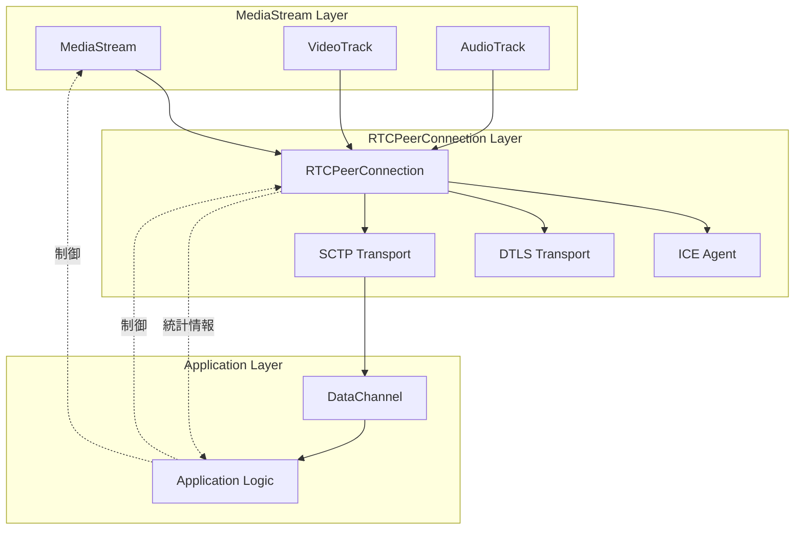
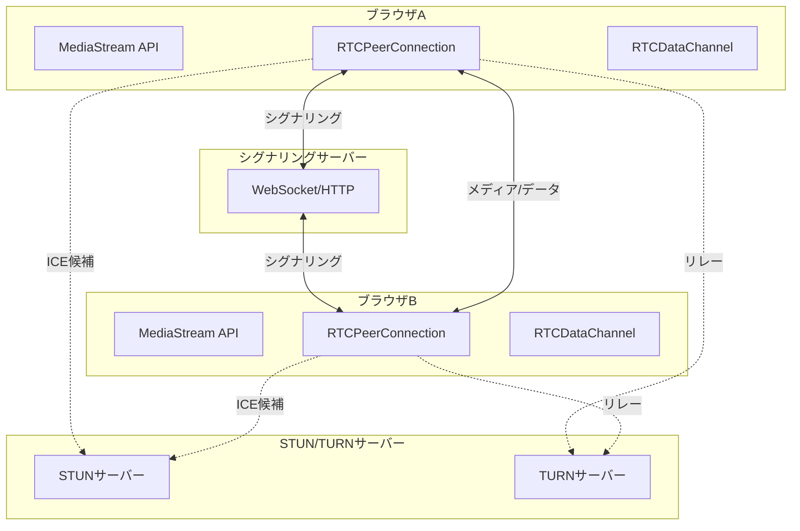
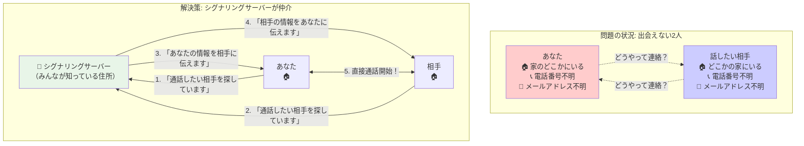
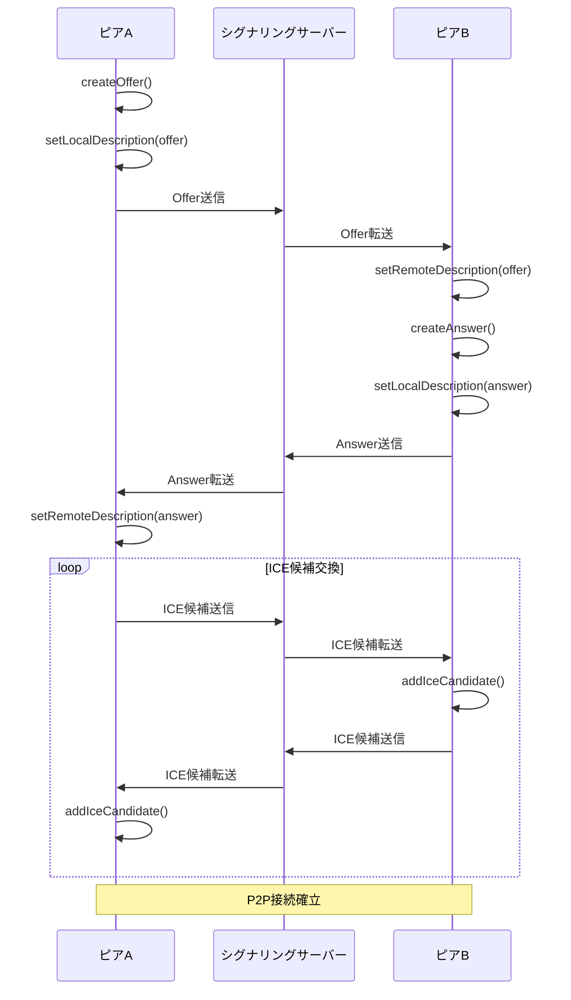
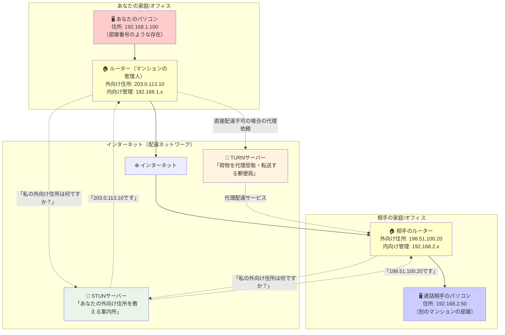
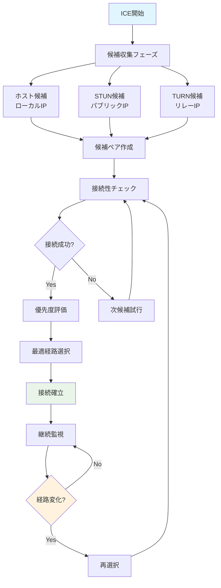

# WebRTC基礎知識

## 目次
- [WebRTCとは](#webrtcとは)
- [主要なコンポーネント](#主要なコンポーネント)
- [アーキテクチャ](#アーキテクチャ)
- [通信プロトコル](#通信プロトコル)
- [シグナリングプロセス](#シグナリングプロセス)
- [メディアストリーム](#メディアストリーム)
- [データチャンネル](#データチャンネル)
- [NAT/ファイアウォール越え](#natファイアウォール越え)
- [セキュリティ](#セキュリティ)
- [実装のベストプラクティス](#実装のベストプラクティス)
- [一般的な問題と解決策](#一般的な問題と解決策)

## WebRTCとは

**WebRTC（Web Real-Time Communication）** は、今まで電話やビデオ通話アプリでしか実現できなかった機能を、ウェブブラウザ上で簡単に実現できるようにする技術です。

### 身近な例で理解するWebRTC

普段私たちがSkypeやZoomでビデオ通話をする時、専用のアプリをダウンロードして使っていますよね。WebRTCは、このような機能をブラウザだけで実現できるようにしました。つまり、ChromeやSafariなどの普通のブラウザを開くだけで、相手とリアルタイムで話したり、画面を共有したりできるのです。

### WebRTCが革新的な理由

従来のビデオ通話システムには以下のような制限がありました：

1. **専用アプリが必要**: 相手と同じアプリをインストールする必要があった
2. **サーバー経由の通信**: 全ての音声・映像データがサービス提供会社のサーバーを経由していた
3. **プラットフォーム依存**: WindowsとMacで違うアプリが必要だったりした
4. **高額な開発コスト**: 企業が独自の通話システムを作るのに莫大な費用がかかった

WebRTCは、これらの問題を一気に解決しました。

### WebRTCの革新的な特徴

#### **1. プラグイン不要のブラウザ標準機能**
特別なソフトをインストールしなくても、ブラウザを開くだけでビデオ通話ができます。これは、ブラウザ自体にビデオ通話機能が組み込まれているからです。まるで、昔は別途必要だった電卓アプリが、今ではスマートフォンに最初から入っているのと同じような感覚です。

#### **2. ピアツーピア（P2P）直接通信**
「ピアツーピア」とは、友達同士が直接話すような通信方式です。従来のシステムでは、あなたと友達の間に「通訳者」のような役割のサーバーがいて、全ての会話がそのサーバーを経由していました。WebRTCでは、最初の「紹介」だけサーバーが行い、その後は直接相手と話せるようになります。

これにより以下のメリットが生まれます：
- **速度向上**: 中継地点がないので、遅延が少ない
- **プライバシー**: 会話内容が第三者のサーバーを通らない
- **コスト削減**: サービス提供者が大きなサーバーを用意する必要がない

#### **3. 完全無料のオープンソース技術**
WebRTCは、誰でも自由に使える技術として公開されています。これは、道路や公園のように「公共財」として提供されているようなものです。企業や個人が自由にこの技術を使ってサービスを作ることができ、利用料も一切かかりません。

#### **4. 強固なセキュリティ**
WebRTCは、軍事レベルの暗号化技術を標準で使用しています。これは、あなたの会話を盗聴しようとする人がいても、暗号を解読するのに数千年かかるほど強力な保護が施されているということです。

#### **5. どこでも動作するクロスプラットフォーム対応**
パソコンのChrome、スマートフォンのSafari、タブレットのFirefoxなど、ほとんどすべてのモダンブラウザで同じように動作します。これにより、相手がどんなデバイスを使っていても、問題なく通話できます。

## 主要なコンポーネント

WebRTCは複数の技術要素が協力して動作しています。これは、オーケストラのようなもので、それぞれの楽器（コンポーネント）が特定の役割を果たすことで、美しい音楽（リアルタイム通信）を奏でることができます。ここでは、主要な3つのコンポーネントについて、なぜそれが必要なのかから詳しく解説します。

### 1. MediaStream（メディアストリーム） - 音声・映像の管理係

**日常での例え話**
MediaStreamは、テレビ局の「技術スタッフ」のような存在です。カメラマンが撮影した映像と、音響スタッフが収録した音声を、視聴者に届ける前に品質チェックし、適切な形式に整える役割を担います。

**なぜこの技術が必要なのか？**

私たちのパソコンやスマートフォンには、様々なメーカーの様々な種類のカメラやマイクが付いています。例えば：
- **カメラ**: Webカメラ、内蔵カメラ、外付けカメラ
- **マイク**: 内蔵マイク、ヘッドセット、外付けマイク
- **スピーカー**: 内蔵スピーカー、イヤホン、外付けスピーカー

これらの機器は、メーカーや型番によって設定方法や利用可能な機能が大きく異なります。MediaStreamは、これらの違いを吸収し、開発者が統一的な方法で扱えるようにする「通訳者」の役割を果たします。

#### MediaStreamが解決する具体的な問題

**1. デバイス抽象化の問題**
例えば、あなたがビデオ通話アプリを作ろうとしたとき、以下のような複雑さに直面します：
- iPhoneのカメラの使い方
- Androidのカメラの使い方  
- Webカメラの使い方
- 各デバイスの解像度設定方法
- 音声品質の調整方法

MediaStreamがあることで、開発者は「カメラを使いたい」「マイクを使いたい」と簡単にリクエストするだけで、技術的な複雑さを気にすることなく、どんなデバイスでも同じように動作するアプリを作ることができます。

**2. プライバシーとセキュリティの問題**
カメラやマイクは非常にプライベートな情報を扱います。MediaStreamは、ユーザーの明示的な許可なしには、これらのデバイスにアクセスできないような仕組みになっています。これは、家の玄関に鍵をかけるのと同じような安全対策です。

```javascript
// ユーザーにカメラとマイクの使用許可を求める例
navigator.mediaDevices.getUserMedia({
  video: {
    // カメラの品質設定を指定
    width: { min: 640, ideal: 1280, max: 1920 },    // 横幅（ピクセル）
    height: { min: 480, ideal: 720, max: 1080 },    // 縦幅（ピクセル）
    frameRate: { ideal: 30 }                        // 1秒間の画像数
  },
  audio: {
    // マイクの音質向上設定
    echoCancellation: true,    // エコー（反響音）を除去
    noiseSuppression: true,    // 雑音を除去
    autoGainControl: true      // 音量を自動調整
  }
}).then(stream => {
  // 許可が得られた場合の処理
  console.log('カメラとマイクが使用可能になりました');
  localVideo.srcObject = stream;  // ビデオ要素に映像を表示
  
  // 取得したストリームの詳細情報を確認
  stream.getVideoTracks().forEach(track => {
    console.log('現在の映像設定:', track.getSettings());
    
    // 通信状況に応じて品質を動的に変更
    if (networkIsSlow()) {
      track.applyConstraints({
        frameRate: { ideal: 15 }  // ネットワークが遅い時は画像数を減らす
      });
    }
  });
}).catch(error => {
  // 許可が得られなかった場合の処理
  console.error('カメラ・マイクの使用が許可されませんでした:', error);
  showUserMessage('ビデオ通話を行うには、カメラとマイクの使用を許可してください');
});
```

#### MediaStreamが提供する具体的な価値

**1. 開発者にとっての価値**
- **学習コストの削減**: 各デバイスの仕様を覚える必要がない
- **開発時間の短縮**: 統一されたAPIで効率的な開発が可能
- **保守性の向上**: 新しいデバイスが登場しても、アプリの修正が不要

**2. ユーザーにとっての価値**
- **プライバシー保護**: 明確な許可システムによる安心感
- **品質の安定性**: 自動的な品質調整による快適な通話体験
- **互換性**: どんなデバイスでも同じように動作

### 2. RTCPeerConnection - 通信の司令塔

**日常での例え話**
RTCPeerConnectionは、国際電話の「交換手」のような存在です。昔、国際電話をかける時は、まず交換手に「アメリカの〇〇番につないでください」とお願いし、交換手が最適な回線を選んで接続してくれました。RTCPeerConnectionも同様に、あなたと通話相手を最適な方法で結びつける役割を担います。

**なぜこの技術が必要なのか？**

インターネットでの通信は、想像以上に複雑です。あなたのパソコンから相手のパソコンに直接つながっているわけではなく、間に多くの「中継地点」があります。

#### インターネット通信の現実的な複雑さ

**1. 家庭内ネットワークの壁（NAT問題）**
あなたの家にあるパソコンやスマートフォンは、通常「192.168.x.x」のような「家庭内専用のアドレス」を持っています。これは、マンションの部屋番号のようなもので、マンション内では「101号室」で通じますが、外部の人に道を教える時は「〇〇マンション101号室」と言わなければ伝わりません。

この「マンション名に相当するもの」が、あなたの家のインターネット回線の「グローバルIPアドレス」です。しかし、相手に「〇〇マンション」までは伝えられても、「何号室にいるか」は外部からはわからないのです。

**2. ファイアウォールという「門番」**
企業や家庭のネットワークには、「ファイアウォール」という安全装置があります。これは、会社の受付や警備員のような役割で、「部外者の立ち入りを禁止」しています。通常のWebサイト閲覧は問題ありませんが、ビデオ通話のような双方向の通信は、この「門番」に止められてしまうことがあります。

**3. 最適な通信経路の選択**
東京と大阪の間には、新幹線、飛行機、高速道路など複数の移動手段があります。同様に、インターネット上でも、あなたのデバイスから相手のデバイスまで、複数の経路が存在します。RTCPeerConnectionは、その時の状況に応じて最適な経路を自動的に選択します。

```javascript
// RTCPeerConnectionの設定例
const pc = new RTCPeerConnection({
  iceServers: [
    // STUNサーバー: 自分のグローバルIPアドレスを教えてくれるサービス
    { urls: 'stun:stun.l.google.com:19302' },
    
    // TURNサーバー: 直接接続できない場合の中継サービス
    {
      urls: 'turn:turn-server.com:3478',
      username: 'user',
      credential: 'pass'
    }
  ],
  iceCandidatePoolSize: 10  // 接続候補を事前に多く用意
});

// 接続状態を人間にわかりやすい形で監視
pc.onconnectionstatechange = () => {
  switch (pc.connectionState) {
    case 'new':
      console.log('接続準備を開始しています...');
      showUserMessage('相手との接続を準備中です');
      break;
    case 'connecting':
      console.log('相手との接続を試行中です...');
      showUserMessage('接続中...少々お待ちください');
      break;
    case 'connected':
      console.log('接続が成功しました！');
      showUserMessage('接続完了！通話を開始できます');
      startCallTimer();  // 通話時間の計測開始
      break;
    case 'disconnected':
      console.log('接続が一時的に切断されました');
      showUserMessage('接続が不安定です。再接続を試行中...');
      attemptReconnection();  // 自動再接続を試行
      break;
    case 'failed':
      console.log('接続に失敗しました');
      showUserMessage('接続できませんでした。ネットワーク状況を確認してください');
      offerReconnectionOptions();  // 再接続オプションを提示
      break;
  }
};

// 通信品質を定期的にチェックし、自動調整
setInterval(async () => {
  const stats = await pc.getStats();
  
  stats.forEach(report => {
    if (report.type === 'inbound-rtp' && report.mediaType === 'video') {
      // 映像の通信品質をチェック
      const packetsReceived = report.packetsReceived || 0;    // 受信したデータ数
      const packetsLost = report.packetsLost || 0;           // 失われたデータ数
      const packetLossRate = packetsLost / (packetsReceived + packetsLost);
      
      if (packetLossRate > 0.05) {  // 5%以上データが失われている場合
        console.log('通信品質が低下しています。映像品質を調整します');
        adjustVideoQuality('low');   // 映像品質を下げて安定性を優先
        showUserMessage('ネットワーク状況に合わせて画質を調整しました');
      } else if (packetLossRate < 0.01) {  // 通信が安定している場合
        console.log('通信状況が良好です。映像品質を向上します');
        adjustVideoQuality('high');  // 高画質に戻す
      }
    }
  });
}, 5000);  // 5秒ごとにチェック
```

#### RTCPeerConnectionが提供する具体的な価値

**1. 複雑さの隠蔽**
開発者は「相手と接続したい」と要求するだけで、以下の複雑な処理がすべて自動で行われます：
- ネットワーク環境の分析
- 最適な接続経路の探索
- セキュリティ設定の適用
- 品質管理と自動調整

**2. 高い成功率**
様々なネットワーク環境に対応しているため、企業のファイアウォール内でも、海外との通信でも、高い確率で接続が成功します。

**3. 自動品質管理**
ネットワークの状況に応じて、映像品質や音声品質を自動的に調整し、常に最適な通話品質を維持します。

### 3. RTCDataChannel - データのメッセンジャー

**日常での例え話**
RTCDataChannelは、ビデオ通話中に「手紙」や「写真」を手渡しできるような機能です。通話をしながら、同時に文字メッセージを送ったり、ファイルを共有したり、ゲームのデータを交換したりできます。

**なぜこの技術が必要なのか？**

従来のビデオ通話システムでは、音声と映像の送受信しかできませんでした。しかし、現代のコミュニケーションでは、それだけでは不十分です。例えば：

- **会議中の資料共有**: 話しながら文書やプレゼンを送りたい
- **チャット機能**: 声に出しにくいことを文字で伝えたい
- **ファイル転送**: 写真や文書をその場で共有したい
- **リアルタイムゲーム**: ビデオ通話しながら一緒にゲームを楽しみたい

#### RTCDataChannelが解決する具体的な問題

**1. 用途に応じた通信方式の選択**
データの種類によって、最適な送信方法は異なります：

- **チャットメッセージ**: 確実に届く必要があるが、多少遅れても問題ない
- **ゲームの位置情報**: 最新の情報が重要で、古い情報は不要
- **ファイル転送**: 大容量でも確実に、完全な形で届ける必要がある

RTCDataChannelは、これらの異なる要求に応えるため、柔軟な設定が可能です。

```javascript
// 用途別のデータチャンネル設定例

// 1. チャットメッセージ用（確実な配信が重要）
const chatChannel = pc.createDataChannel('chat-messages', {
  ordered: true,           // メッセージの順序を保証
  maxRetransmits: 10,     // 失敗した場合、最大10回再送
  protocol: 'json'        // JSON形式でデータを送信
});

// 2. ゲームの位置情報用（速度が重要、古い情報は不要）
const gameChannel = pc.createDataChannel('game-updates', {
  ordered: false,          // 順序は重要でない
  maxPacketLifeTime: 100,  // 100ミリ秒以内に届かなければ破棄
  protocol: 'binary'       // バイナリ形式で高速送信
});

// 3. ファイル転送用（大容量でも確実に）
const fileChannel = pc.createDataChannel('file-transfer', {
  ordered: true,           // ファイルの順序は重要
  maxRetransmits: 50,     // 大容量なので再送回数を多めに
  protocol: 'binary'      // バイナリデータとして送信
});

// チャットメッセージの送信例
chatChannel.onopen = () => {
  console.log('チャット機能が利用可能になりました');
  
  // メッセージ送信
  chatChannel.send(JSON.stringify({
    type: 'message',
    content: 'こんにちは！元気ですか？',
    sender: 'あなたの名前',
    timestamp: new Date().toISOString()
  }));
};

// ゲームデータの送信例（プレイヤーの位置情報）
function sendPlayerPosition(x, y) {
  if (gameChannel.readyState === 'open') {
    const positionData = JSON.stringify({
      type: 'player-position',
      x: x,
      y: y,
      timestamp: Date.now()
    });
    gameChannel.send(positionData);
  }
}

// ファイル転送の実装例
async function sendFile(file) {
  console.log(`ファイル "${file.name}" の送信を開始します`);
  showProgressBar();  // 進捗バーを表示
  
  const chunkSize = 16384;  // 16KBずつに分割して送信
  let offset = 0;
  let sentChunks = 0;
  const totalChunks = Math.ceil(file.size / chunkSize);
  
  // ファイル情報を最初に送信
  fileChannel.send(JSON.stringify({
    type: 'file-start',
    name: file.name,
    size: file.size,
    totalChunks: totalChunks
  }));
  
  // ファイルを小さな塊に分けて送信
  while (offset < file.size) {
    const chunk = file.slice(offset, offset + chunkSize);
    const arrayBuffer = await chunk.arrayBuffer();
    
    fileChannel.send(arrayBuffer);
    
    offset += chunkSize;
    sentChunks++;
    
    // 進捗を表示
    const progress = (sentChunks / totalChunks) * 100;
    updateProgressBar(progress);
    console.log(`送信進捗: ${progress.toFixed(1)}%`);
  }
  
  // 送信完了通知
  fileChannel.send(JSON.stringify({
    type: 'file-complete',
    name: file.name
  }));
  
  console.log('ファイル送信が完了しました');
  hideProgressBar();
}

// 受信データの処理
chatChannel.onmessage = (event) => {
  if (typeof event.data === 'string') {
    // テキストデータ（JSON）の場合
    const message = JSON.parse(event.data);
    
    switch (message.type) {
      case 'message':
        displayChatMessage(message.sender, message.content, message.timestamp);
        break;
      case 'file-start':
        prepareFileReceive(message.name, message.size, message.totalChunks);
        break;
      case 'file-complete':
        completeFileReceive(message.name);
        break;
    }
  } else {
    // バイナリデータ（ファイルの一部）の場合
    appendFileChunk(event.data);
  }
};
```

#### RTCDataChannelが提供する具体的な価値

**1. 統合されたコミュニケーション体験**
音声・映像・テキスト・ファイルをすべて同じ接続で扱えるため、ユーザーにとって自然で一貫した体験を提供できます。

**2. 効率的なリソース使用**
新しい接続を作る必要がなく、既存のビデオ通話の接続を活用するため、ネットワーク負荷とサーバー負荷を最小限に抑えられます。

**3. 高いセキュリティ**
ビデオ通話と同じ暗号化技術が適用されるため、チャットやファイル転送も安全に行えます。

### コンポーネント間の相互作用



#### なぜこの階層構造なのか？

1. **責任分離**: 各層が特定の責任を持つ
2. **再利用性**: 下位層は複数の上位層で共有可能
3. **拡張性**: 新機能追加時の影響範囲限定
4. **保守性**: 各層独立での開発・テスト・デバッグ

## アーキテクチャ



## 通信プロトコル

### 1. シグナリングプロトコル
- **SDP（Session Description Protocol）**: セッション記述
- **ICE（Interactive Connectivity Establishment）**: 接続確立
- **WebSocket**: リアルタイムシグナリング

### 2. メディアプロトコル
- **RTP（Real-time Transport Protocol）**: メディア配信
- **RTCP（RTP Control Protocol）**: 制御情報
- **SRTP（Secure RTP）**: 暗号化されたRTP

### 3. データプロトコル
- **SCTP（Stream Control Transmission Protocol）**: データチャンネル
- **DTLS（Datagram Transport Layer Security）**: 暗号化

## シグナリングプロセス - 初対面の人同士をつなぐ「紹介者」の役割

### 身近な例で理解するシグナリング

想像してみてください。あなたが海外旅行に行った時、現地で友達を作りたいとします。しかし、お互いの連絡先も知らず、どこにいるかもわからない状況では、どうやって出会うことができるでしょうか？

この問題を解決するのが「共通の知人」や「紹介サービス」です。例えば：
1. **共通の友人**: 「田中さん、佐藤さんを紹介するよ」
2. **マッチングアプリ**: お互いの情報を登録して、アプリが相手を紹介
3. **イベント主催者**: パーティーで「皆さん、紹介し合ってください」

WebRTCの「シグナリングサーバー」は、まさにこの「紹介者」の役割を果たします。

### なぜシグナリングサーバーが絶対に必要なのか？

WebRTCは「ピアツーピア（P2P）通信」、つまり「相手と直接つながる技術」ですが、ここに根本的な矛盾があります。それが **「ブートストラップ問題」** です。

#### ブートストラップ問題の詳細説明

「ブートストラップ」とは、「自分の靴ひもを引っ張って自分を持ち上げる」という物理的に不可能なことを表現した言葉です。つまり、「最初の一歩を踏み出すために、すでにその一歩が踏み出されている必要がある」という、循環的な問題を指します。

WebRTCにおけるブートストラップ問題：
- **あなた**: 相手と話したいけど、相手の連絡先がわからない
- **相手**: あなたと話したいけど、あなたの連絡先がわからない
- **結果**: お互いに連絡を取りたいのに、最初の連絡方法がない

この問題を図で表すと以下のようになります：



### シグナリングサーバーの3つの主要な役割

#### 1. 技術仕様の交換 - 「お互いの得意分野を教え合う」

**身近な例え話**
これは、初めて会った人同士が「お互いの共通言語」を見つける過程に似ています。

- あなた: 「日本語、英語、少し中国語が話せます」
- 相手: 「英語、フランス語、少しスペイン語が話せます」
- 結論: 「英語で話しましょう！」

WebRTCでも同様に、お互いのデバイスが「対応している技術」を教え合います：

**あなたのデバイス**:
- 映像コーデック: H.264、VP8、VP9に対応
- 音声コーデック: OPUS、G.722に対応
- 最大解像度: 1080p
- 最大フレームレート: 30fps

**相手のデバイス**:
- 映像コーデック: H.264、VP9に対応
- 音声コーデック: OPUSに対応
- 最大解像度: 720p
- 最大フレームレート: 25fps

**交渉結果**:
- 映像: H.264を使用（両方対応）
- 音声: OPUSを使用（両方対応）
- 解像度: 720p（低い方に合わせる）
- フレームレート: 25fps（低い方に合わせる）

この交渉プロセスを「SDP（Session Description Protocol）交換」と呼びます。

```javascript
// 実際のコード例：技術仕様の交換
class SignalingManager {
  constructor(websocketUrl) {
    this.ws = new WebSocket(websocketUrl);
    this.pc = new RTCPeerConnection(config);
    
    this.setupWebSocketHandlers();
    this.setupPeerConnectionHandlers();
  }
  
  setupWebSocketHandlers() {
    this.ws.onmessage = async (event) => {
      const message = JSON.parse(event.data);
      
      switch (message.type) {
        case 'offer':
          console.log('相手からの技術仕様提案を受信しました');
          await this.handleOffer(message.sdp);
          break;
        case 'answer':
          console.log('相手からの技術仕様回答を受信しました');
          await this.handleAnswer(message.sdp);
          break;
        case 'ice-candidate':
          console.log('相手からの接続経路候補を受信しました');
          await this.handleIceCandidate(message.candidate);
          break;
      }
    };
  }
  
  // 通話を開始する側：技術仕様の提案を送信
  async createAndSendOffer(targetUserId) {
    try {
      console.log('相手に技術仕様の提案を作成中...');
      
      const offer = await this.pc.createOffer({
        offerToReceiveAudio: true,  // 音声を受信したい
        offerToReceiveVideo: true   // 映像を受信したい
      });
      
      await this.pc.setLocalDescription(offer);
      console.log('自分の技術仕様を設定完了');
      
      // シグナリングサーバー経由で相手に送信
      this.ws.send(JSON.stringify({
        type: 'offer',
        targetUserId: targetUserId,
        sdp: offer,
        // 人間にもわかりやすい形での能力情報
        capabilities: {
          video: {
            codecs: ['H.264', 'VP8', 'VP9'],
            resolutions: ['720p', '1080p'],
            frameRates: [15, 30, 60]
          },
          audio: {
            codecs: ['OPUS', 'G.722'],
            sampleRates: [16000, 48000]
          }
        }
      }));
      
      console.log('相手に技術仕様の提案を送信しました');
      showUserMessage('相手との接続設定を交渉中です...');
      
    } catch (error) {
      console.error('技術仕様の提案作成に失敗:', error);
      showUserMessage('接続設定でエラーが発生しました');
    }
  }
  
  // 通話を受ける側：技術仕様の提案に回答
  async handleOffer(sdp) {
    try {
      console.log('相手からの技術仕様提案を確認中...');
      await this.pc.setRemoteDescription(new RTCSessionDescription(sdp));
      
      console.log('自分の技術仕様で回答を作成中...');
      const answer = await this.pc.createAnswer();
      await this.pc.setLocalDescription(answer);
      
      // シグナリングサーバー経由で回答を送信
      this.ws.send(JSON.stringify({
        type: 'answer',
        sdp: answer
      }));
      
      console.log('技術仕様の交渉が完了しました');
      showUserMessage('接続設定の交渉が完了しました');
      
    } catch (error) {
      console.error('技術仕様の回答作成に失敗:', error);
      showUserMessage('接続設定の交渉でエラーが発生しました');
    }
  }
}
```

#### 2. 接続経路の情報交換 - 「お互いの住所を教え合う」

**身近な例え話**
これは、友達を家に招待する時の住所交換に似ています。

あなたが友達を家に招待したい場合：
1. **基本住所**: 「東京都新宿区○○1-2-3」を教える
2. **最寄り駅**: 「新宿駅から徒歩5分」も教える
3. **車の場合**: 「高速道路のICから10分」も教える
4. **緊急時**: 「タクシーで来る場合はこの住所で」も教える

WebRTCでも同様に、「あなたのデバイスにたどり着く方法」を複数教え合います。

**接続経路の種類**:
1. **ローカルアドレス**: 家庭内ネットワークでの住所
2. **パブリックアドレス**: インターネット上での住所
3. **リレーアドレス**: 中継サーバー経由での住所

```javascript
// ICE候補（接続経路情報）の交換
setupPeerConnectionHandlers() {
  // 新しい接続経路が見つかったときの処理
  this.pc.onicecandidate = (event) => {
    if (event.candidate) {
      const candidate = event.candidate;
      
      // 人間にもわかりやすい説明
      let description = '';
      switch (candidate.type) {
        case 'host':
          description = '同じネットワーク内での直接接続';
          break;
        case 'srflx':
          description = 'インターネット経由での直接接続';
          break;
        case 'relay':
          description = '中継サーバー経由での接続';
          break;
      }
      
      console.log(`新しい接続経路を発見: ${description}`, {
        type: candidate.type,
        address: candidate.address,
        port: candidate.port,
        protocol: candidate.protocol
      });
      
      // シグナリングサーバー経由で相手に送信
      this.ws.send(JSON.stringify({
        type: 'ice-candidate',
        candidate: candidate
      }));
      
      showUserMessage(`接続経路を発見: ${description}`);
    } else {
      console.log('すべての接続経路の探索が完了しました');
      showUserMessage('接続経路の探索が完了しました');
    }
  };
  
  // 接続経路の探索状態を監視
  this.pc.onicegatheringstatechange = () => {
    console.log('接続経路の探索状態:', this.pc.iceGatheringState);
    
    switch (this.pc.iceGatheringState) {
      case 'new':
        console.log('接続経路の探索を開始準備中');
        showUserMessage('接続経路を探索しています...');
        break;
      case 'gathering':
        console.log('接続経路を探索中...');
        showUserMessage('最適な接続方法を探しています...');
        break;
      case 'complete':
        console.log('接続経路の探索が完了');
        showUserMessage('接続経路の探索が完了しました');
        break;
    }
  };
}

// 相手からの接続経路情報を受信
async handleIceCandidate(candidate) {
  try {
    await this.pc.addIceCandidate(new RTCIceCandidate(candidate));
    console.log('相手からの接続経路情報を追加しました:', candidate);
    showUserMessage('相手との接続経路を設定中...');
  } catch (error) {
    console.error('接続経路情報の追加に失敗:', error);
  }
}
```

#### 3. セッション管理 - 「パーティーの主催者」的な役割

**身近な例え話**
これは、パーティーや会議の主催者のような役割です。

パーティー主催者の仕事：
- **招待管理**: 誰が参加するかの管理
- **会場準備**: 適切な会場（部屋）の用意
- **進行管理**: パーティーの開始・終了の管理
- **問題対応**: トラブルが起きた時の対処

シグナリングサーバーも同様に、ビデオ通話の「場」を管理します。

```javascript
// 高度なセッション管理の実装例
class SessionManager extends SignalingManager {
  constructor(websocketUrl) {
    super(websocketUrl);
    this.room = null;
    this.participants = new Map();  // 参加者一覧
    this.isHost = false;           // 自分が主催者かどうか
  }
  
  // 新しい通話ルームを作成（パーティーを主催）
  async createRoom(roomName, options = {}) {
    console.log(`新しい通話ルーム "${roomName}" を作成します`);
    
    const roomConfig = {
      type: 'create-room',
      roomName: roomName,
      
      // 基本設定
      maxParticipants: options.maxParticipants || 10,  // 最大参加者数
      requiresPassword: options.password ? true : false, // パスワード保護
      
      // メディア設定
      mediaConstraints: {
        video: options.video !== false,    // 映像通話を許可
        audio: options.audio !== false,    // 音声通話を許可
        screen: options.screen === true    // 画面共有を許可
      },
      
      // 権限設定
      permissions: {
        canShare: options.canShare !== false,   // ファイル共有権限
        canRecord: options.canRecord === true,  // 録画権限
        canKick: options.canKick === true       // 参加者キック権限
      }
    };
    
    this.ws.send(JSON.stringify(roomConfig));
    this.isHost = true;
    
    console.log('通話ルームの作成をサーバーに要求しました');
    showUserMessage(`通話ルーム "${roomName}" を作成中...`);
  }
  
  // 既存の通話ルームに参加
  async joinRoom(roomId, password = null) {
    console.log(`通話ルーム "${roomId}" に参加します`);
    
    this.ws.send(JSON.stringify({
      type: 'join-room',
      roomId: roomId,
      password: password,
      userInfo: {
        name: this.userName,
        capabilities: this.getDeviceCapabilities()
      }
    }));
    
    showUserMessage(`通話ルーム "${roomId}" に参加中...`);
  }
  
  // 新しい参加者が入ってきた時の処理
  handleUserJoined(userInfo) {
    console.log(`新しい参加者が入室: ${userInfo.name} (${userInfo.userId})`);
    
    // 参加者情報を管理リストに追加
    this.participants.set(userInfo.userId, {
      ...userInfo,
      peerConnection: this.createPeerConnection(userInfo.userId),
      streams: new Map(),
      connectionState: 'connecting',
      joinTime: new Date()
    });
    
    // ユーザーインターフェースに参加者を表示
    this.addParticipantToUI(userInfo);
    
    // 主催者の場合、新規参加者に技術仕様提案を送信
    if (this.isHost) {
      console.log(`主催者として ${userInfo.name} に接続を開始します`);
      this.createAndSendOffer(userInfo.userId);
    }
    
    showUserMessage(`${userInfo.name} さんが参加しました`);
    this.updateParticipantCount();
  }
  
  // 参加者が退出した時の処理
  handleUserLeft(userId) {
    const participant = this.participants.get(userId);
    
    if (participant) {
      console.log(`参加者が退出: ${participant.name} (${userId})`);
      
      // 接続のクリーンアップ
      participant.peerConnection.close();
      participant.streams.forEach(stream => {
        stream.getTracks().forEach(track => track.stop());
      });
      
      // 管理リストから削除
      this.participants.delete(userId);
      
      // ユーザーインターフェースから削除
      this.removeParticipantFromUI(userId);
      
      showUserMessage(`${participant.name} さんが退出しました`);
      this.updateParticipantCount();
    }
  }
  
  // 自分のデバイス能力を取得
  getDeviceCapabilities() {
    return {
      video: {
        maxResolution: '1080p',
        codecs: RTCRtpReceiver.getCapabilities('video').codecs
      },
      audio: {
        codecs: RTCRtpReceiver.getCapabilities('audio').codecs,
        echoCancellation: true
      },
      browser: {
        name: this.getBrowserName(),
        version: this.getBrowserVersion()
      }
    };
  }
  
  // 参加者数の表示を更新
  updateParticipantCount() {
    const count = this.participants.size + 1; // +1は自分自身
    document.getElementById('participant-count').textContent = 
      `参加者: ${count}人`;
  }
}
```

### シグナリングプロトコルの選択

#### WebSocket vs HTTP vs その他

```javascript
// WebSocket（推奨）- リアルタイム双方向通信
class WebSocketSignaling {
  constructor(url) {
    this.ws = new WebSocket(url);
    this.messageQueue = [];
    this.connected = false;
    
    this.ws.onopen = () => {
      this.connected = true;
      // キューに溜まったメッセージを送信
      this.messageQueue.forEach(msg => this.ws.send(msg));
      this.messageQueue = [];
    };
    
    this.ws.onclose = () => {
      this.connected = false;
      // 自動再接続
      setTimeout(() => this.reconnect(), 1000);
    };
  }
  
  send(message) {
    if (this.connected) {
      this.ws.send(JSON.stringify(message));
    } else {
      this.messageQueue.push(JSON.stringify(message));
    }
  }
}

// HTTP Polling（フォールバック）- WebSocket非対応環境
class HTTPPollingSignaling {
  constructor(baseUrl) {
    this.baseUrl = baseUrl;
    this.pollInterval = 1000;
    this.sessionId = null;
    this.lastMessageId = 0;
  }
  
  async startPolling() {
    setInterval(async () => {
      try {
        const response = await fetch(`${this.baseUrl}/poll`, {
          method: 'POST',
          headers: { 'Content-Type': 'application/json' },
          body: JSON.stringify({
            sessionId: this.sessionId,
            lastMessageId: this.lastMessageId
          })
        });
        
        const messages = await response.json();
        messages.forEach(msg => this.handleMessage(msg));
        
        if (messages.length > 0) {
          this.lastMessageId = messages[messages.length - 1].id;
        }
      } catch (error) {
        console.error('ポーリングエラー:', error);
      }
    }, this.pollInterval);
  }
  
  async send(message) {
    await fetch(`${this.baseUrl}/send`, {
      method: 'POST',
      headers: { 'Content-Type': 'application/json' },
      body: JSON.stringify({
        sessionId: this.sessionId,
        message: message
      })
    });
  }
}
```

### シグナリングサーバーが提供する価値

1. **ブートストラップ解決**: 初期接続の鶏と卵問題を解決
2. **セッション調整**: 複雑なネゴシエーションプロセスの仲介
3. **スケーラビリティ**: 多数参加者の効率的管理
4. **信頼性**: 接続失敗時の調整とリトライ
5. **セキュリティ**: 認証・認可の中央管理

WebRTCの接続確立は以下のステップで行われます：

### 1. Offer/Answer交換

```javascript
// Offer作成（発信者）
const offer = await pc.createOffer();
await pc.setLocalDescription(offer);
// シグナリングサーバー経由でOfferを送信

// Answer作成（受信者）
await pc.setRemoteDescription(offer);
const answer = await pc.createAnswer();
await pc.setLocalDescription(answer);
// シグナリングサーバー経由でAnswerを送信
```

### 2. ICE候補交換

```javascript
pc.onicecandidate = (event) => {
  if (event.candidate) {
    // シグナリングサーバー経由でICE候補を送信
    sendIceCandidate(event.candidate);
  }
};

// リモートICE候補の追加
pc.addIceCandidate(remoteCandiate);
```

### 3. シーケンス図



## メディアストリーム

### 1. メディア取得

```javascript
// カメラ・マイクアクセス
const constraints = {
  video: {
    width: { min: 640, ideal: 1280, max: 1920 },
    height: { min: 480, ideal: 720, max: 1080 },
    frameRate: { min: 15, ideal: 30, max: 60 }
  },
  audio: {
    echoCancellation: true,
    noiseSuppression: true,
    autoGainControl: true
  }
};

const stream = await navigator.mediaDevices.getUserMedia(constraints);
```

### 2. 画面共有

```javascript
// 画面共有
const displayStream = await navigator.mediaDevices.getDisplayMedia({
  video: true,
  audio: true
});
```

### 3. メディア制御

```javascript
// トラック制御
stream.getVideoTracks().forEach(track => {
  track.enabled = false; // 映像停止
});

stream.getAudioTracks().forEach(track => {
  track.enabled = false; // 音声ミュート
});
```

## データチャンネル

### 1. チャンネル作成と設定

```javascript
const dataChannel = pc.createDataChannel('chat', {
  ordered: true,        // 順序保証
  maxRetransmits: 3,   // 再送回数
  protocol: 'json'     // プロトコル指定
});
```

### 2. イベントハンドリング

```javascript
dataChannel.onopen = () => {
  console.log('データチャンネル開通');
};

dataChannel.onmessage = (event) => {
  const data = JSON.parse(event.data);
  console.log('受信:', data);
};

dataChannel.onerror = (error) => {
  console.error('エラー:', error);
};

dataChannel.onclose = () => {
  console.log('データチャンネル閉鎖');
};
```

### 3. データ送信

```javascript
// テキストデータ送信
dataChannel.send(JSON.stringify({
  type: 'message',
  content: 'Hello!'
}));

// バイナリデータ送信
const arrayBuffer = new ArrayBuffer(1024);
dataChannel.send(arrayBuffer);
```

## NAT/ファイアウォール越え - インターネットの「住所問題」を解決する技術

### 身近な例で理解するインターネットの住所システム

普段私たちが郵便物を送る時、相手の住所が必要ですよね。「東京都新宿区○○1-2-3」のような住所があれば、郵便配達員は確実に荷物を届けることができます。

しかし、インターネットの世界では、この「住所システム」が複雑になっています。それが、WebRTCで直接通信を行う際の大きな障害となっているのです。

### なぜSTUN/TURNサーバーが必要なのか？

#### インターネット住所システムの現実的な問題

想像してみてください。あなたが大きなマンションに住んでいるとします：

1. **マンション全体の住所**: 「東京都新宿区○○1-2-3」（これがグローバルIPアドレス）
2. **あなたの部屋番号**: 「101号室」（これがプライベートIPアドレス）

外部の人があなたに荷物を送る時：
- **マンションまでは届く**: 配達員は「東京都新宿区○○1-2-3」で建物を見つけられる
- **部屋まで届かない**: 「101号室」の情報が外部からはわからない

これと全く同じ問題が、インターネットでも起きています。

#### 現代インターネット環境の複雑さ



### 1. STUN（Session Traversal Utilities for NAT）- 「住所案内所」

**身近な例え話**
STUNサーバーは、街角にある「案内所」のような存在です。

あなた: 「すみません、私がここから外の人にどう見えているか教えてください」
案内所: 「あなたは外から見ると『東京都新宿区○○1-2-3』の住所で見えますよ」

**STUNサーバーの具体的な役割**

家庭や企業のネットワークでは、複数のデバイス（パソコン、スマートフォン、タブレットなど）が1つのインターネット回線を共有しています。これを可能にしているのが「NAT（Network Address Translation）」という技術です。

#### NATの仕組みと問題点

**1. 外向きの通信（うまくいく場合）**
- あなたのパソコン → 外部のWebサイト ✅
- リクエストが外に出る時に、ルーターが「送信者情報」を記録
- 返事が戻ってくる時に、記録を見て適切なパソコンに配達

**2. 内向きの通信（問題が発生する場合）**
- 外部のパソコン → あなたのパソコン ❌
- ルーターに記録がないため、どのデバイスに配達すべきかわからない
- 結果として、通信がブロックされる

STUNサーバーは、この問題を解決するための第一歩として、「あなたの外向けアドレス」を教えてくれます。

```javascript
// STUNサーバーの設定と使用例
const pc = new RTCPeerConnection({
  iceServers: [
    // Googleが提供する無料STUNサーバー
    { urls: 'stun:stun.l.google.com:19302' },
    { urls: 'stun:stun1.l.google.com:19302' },
    { urls: 'stun:stun2.l.google.com:19302' }
  ]
});

// STUNサーバーによる接続候補の発見プロセスを監視
pc.onicegatheringstatechange = () => {
  console.log('接続経路の探索状態:', pc.iceGatheringState);
  
  if (pc.iceGatheringState === 'complete') {
    console.log('STUNサーバーによる住所発見が完了しました');
    analyzeDiscoveredAddresses();
  }
};

pc.onicecandidate = (event) => {
  if (event.candidate) {
    const candidate = event.candidate;
    
    // 発見された接続経路の種類を人間にわかりやすく説明
    let description = '';
    let reliability = '';
    
    switch (candidate.type) {
      case 'host':
        description = '同じネットワーク内での直接接続';
        reliability = '非常に高速・安定';
        console.log(`🏠 ${description} (${reliability})`);
        break;
        
      case 'srflx':  // Server Reflexive
        description = 'STUNサーバーが発見したインターネット経由の直接接続';
        reliability = '高速・安定';
        console.log(`🌐 ${description} (${reliability})`);
        break;
        
      case 'relay':
        description = 'TURNサーバー経由の中継接続';
        reliability = '安定だが速度は中程度';
        console.log(`📮 ${description} (${reliability})`);
        break;
    }
    
    // 詳細な技術情報をログ出力
    console.log('接続候補の詳細:', {
      type: candidate.type,
      protocol: candidate.protocol,  // UDP or TCP
      address: candidate.address,    // IPアドレス
      port: candidate.port,         // ポート番号
      priority: candidate.priority   // 優先度
    });
    
    // ユーザーにわかりやすいメッセージを表示
    showUserMessage(`接続経路を発見: ${description}`);
  }
};

// 発見されたアドレスの分析
function analyzeDiscoveredAddresses() {
  pc.getStats().then(stats => {
    let hasDirectConnection = false;
    let hasRelayConnection = false;
    
    stats.forEach(report => {
      if (report.type === 'local-candidate') {
        console.log('発見された接続候補:', {
          candidateType: report.candidateType,
          networkType: report.networkType,
          address: report.address,
          priority: report.priority
        });
        
        if (report.candidateType === 'srflx') {
          hasDirectConnection = true;
        } else if (report.candidateType === 'relay') {
          hasRelayConnection = true;
        }
      }
    });
    
    // 接続可能性の評価をユーザーに報告
    if (hasDirectConnection) {
      showUserMessage('✅ 高速な直接接続が可能です');
    } else if (hasRelayConnection) {
      showUserMessage('⚠️ 中継サーバー経由の接続のみ可能です');
    } else {
      showUserMessage('❌ 接続に問題がある可能性があります');
    }
  });
}
```

#### STUNサーバーが提供する具体的な価値

**1. 低コスト運用**
- 軽量なサーバーで数千〜数万のクライアントに対応可能
- 通信内容を中継しないため、サーバー負荷が低い
- 多くの無料サービスが利用可能

**2. プライバシー保護**
- 音声や映像データは一切通らない
- 単純に「住所情報」を教えるだけ
- 通話内容が第三者に漏れる心配がない

**3. 高速性**
- 成功すれば最も高速な接続方法
- サーバーを経由しない直接通信
- 遅延が最小限に抑えられる

### 2. TURN（Traversal Using Relays around NAT）- 「代理配達サービス」

**身近な例え話**
TURNサーバーは、荷物の「代理受取・転送サービス」のような存在です。

直接配達が困難な場合：
1. 送り主 → 代理配達業者の営業所に荷物を預ける
2. 代理配達業者 → 受取人に荷物を届ける
3. この過程で、送り主と受取人は直接会うことがない

**TURNサーバーが必要になる具体的な状況**

#### 1. 対称NAT環境
これは、最も制限的なネットワーク環境です。

**通常のNAT（うまくいく場合）**:
- あなたのパソコンが外部サーバーAに接続
- ルーターが記録: 「この通信の返事はこのパソコンに」
- 外部からの返事が正しく配達される

**対称NAT（問題のある場合）**:
- あなたのパソコンが外部サーバーAに接続 → ポート1000を使用
- あなたのパソコンが外部サーバーBに接続 → ポート2000を使用
- サーバーAとサーバーBが通信しようとしても、ポート番号が異なるため失敗

#### 2. 厳格なファイアウォール
企業や学校のネットワークでよく見られる状況です。

- 外向きの通信: 許可された特定のサイトのみアクセス可能
- 内向きの通信: 一切禁止
- 結果: P2P通信が完全にブロックされる

```javascript
// TURNサーバーの設定例
const pc = new RTCPeerConnection({
  iceServers: [
    // まずSTUNで直接接続を試行
    { urls: 'stun:stun.l.google.com:19302' },
    
    // STUNで失敗した場合のTURNサーバー設定
    {
      urls: [
        'turn:your-turn-server.com:3478',              // UDP経由
        'turn:your-turn-server.com:3478?transport=tcp', // TCP経由（ファイアウォール対策）
        'turns:your-turn-server.com:5349'              // TLS暗号化版（セキュリティ強化）
      ],
      username: 'your-username',    // TURNサーバーの認証情報
      credential: 'your-password'
    }
  ],
  
  // TURNサーバーのみを使用する設定（企業環境など）
  iceTransportPolicy: 'relay'  // 'all'（すべて試行） | 'relay'（TURN必須）
});

// 接続経路の分析と品質監視
pc.onconnectionstatechange = () => {
  if (pc.connectionState === 'connected') {
    console.log('接続が確立されました。使用経路を分析中...');
    analyzeConnectionPath();
    startQualityMonitoring();
  }
};

async function analyzeConnectionPath() {
  const stats = await pc.getStats();
  let connectionInfo = {
    usingTURN: false,
    bandwidthUsage: 0,
    connectionType: '',
    quality: 'unknown'
  };
  
  stats.forEach(report => {
    if (report.type === 'candidate-pair' && report.state === 'succeeded') {
      console.log('実際に使用されている接続経路:', {
        local: report.localCandidateType,
        remote: report.remoteCandidateType,
        bytesSent: report.bytesSent,
        bytesReceived: report.bytesReceived,
        totalRoundTripTime: report.totalRoundTripTime,
        currentRoundTripTime: report.currentRoundTripTime
      });
      
      // TURN使用の判定
      if (report.localCandidateType === 'relay' || 
          report.remoteCandidateType === 'relay') {
        connectionInfo.usingTURN = true;
        connectionInfo.connectionType = 'TURNサーバー経由';
        
        // 帯域使用量の計算（TURNは双方向で2倍の帯域を消費）
        connectionInfo.bandwidthUsage = 
          (report.bytesSent + report.bytesReceived) * 2;
        
        console.log(`📮 TURNサーバー経由で接続中`);
        console.log(`📊 サーバー負荷: ${connectionInfo.bandwidthUsage} bytes`);
        
        showUserMessage('中継サーバー経由で接続されています');
        
      } else if (report.localCandidateType === 'srflx' || 
                 report.remoteCandidateType === 'srflx') {
        connectionInfo.connectionType = '直接接続';
        console.log(`🌐 インターネット経由で直接接続中`);
        showUserMessage('高速な直接接続で通話中です');
        
      } else {
        connectionInfo.connectionType = 'ローカル接続';
        console.log(`🏠 同一ネットワーク内で直接接続中`);
        showUserMessage('最高速度のローカル接続で通話中です');
      }
    }
  });
  
  return connectionInfo;
}

// TURN使用時の品質監視
function startQualityMonitoring() {
  setInterval(async () => {
    const stats = await pc.getStats();
    
    stats.forEach(report => {
      if (report.type === 'inbound-rtp') {
        const quality = {
          jitter: report.jitter,              // 遅延のばらつき
          packetsLost: report.packetsLost,    // 失われたデータ
          packetsReceived: report.packetsReceived  // 受信したデータ
        };
        
        // 品質評価
        if (quality.jitter > 0.1 || quality.packetsLost > 10) {
          console.warn('⚠️ 通信品質が低下しています:', quality);
          
          // TURN使用時の品質改善措置
          if (await isusingTURN()) {
            console.log('TURNサーバー経由のため、映像品質を調整します');
            adjustQualityForRelay();
            showUserMessage('ネットワーク状況に合わせて品質を最適化しました');
          }
        } else {
          console.log('✅ 通信品質良好:', quality);
        }
      }
    });
  }, 5000);  // 5秒ごとにチェック
}

// TURN使用時の品質最適化
function adjustQualityForRelay() {
  // 映像品質を下げて安定性を優先
  const videoSender = pc.getSenders().find(s => 
    s.track && s.track.kind === 'video'
  );
  
  if (videoSender) {
    const params = videoSender.getParameters();
    
    // TURNサーバーの負荷を考慮した設定
    params.encodings[0].maxBitrate = 300000;  // 300kbps（低画質）
    params.encodings[0].maxFramerate = 15;    // 15fps（滑らかさより安定性）
    
    videoSender.setParameters(params);
    console.log('映像品質をTURN最適化設定に変更しました');
  }
}
```

#### TURNサーバーが提供する具体的な価値

**1. 接続保証**
- ほぼ100%の接続成功率
- どんなに厳しいネットワーク環境でも通話可能
- 企業や学校のファイアウォール内でも動作

**2. 信頼性**
- 一度接続すれば安定した通話品質
- ネットワーク変動に強い
- 自動的な品質調整機能

**3. セキュリティ**
- TLS暗号化による安全な中継
- 認証機能による不正利用防止
- ログ管理による追跡可能性

**ただし、以下のトレードオフがあります:**

**1. コスト**
- サーバー運用費用が必要
- 帯域使用量が2倍になる
- ユーザー数に応じてスケールが必要

**2. パフォーマンス**
- 直接接続より遅延が大きい
- サーバー経由のため速度制限あり
- 画質・音質の制約

### 3. ICE（Interactive Connectivity Establishment）- 「最適経路の自動選択システム」

**身近な例え話**
ICEは、荷物配達における「最適ルート自動選択システム」のような存在です。

配達員が荷物を届ける時：
1. **候補ルートの洗い出し**: 徒歩、自転車、バイク、車、電車
2. **各ルートの評価**: 速度、コスト、確実性、天候への強さ
3. **最適ルートの選択**: 総合評価で最も良いルートを選択
4. **動的な再選択**: 渋滞や事故があれば別ルートに変更

ICEも同様に、WebRTCの接続において最適な経路を自動選択します。



#### ICEが提供する価値
1. **自動化**: 複雑な経路選択の完全自動化
2. **最適化**: 遅延・帯域・コストの総合最適化
3. **堅牢性**: 単一障害点の排除
4. **適応性**: 動的ネットワーク環境への対応

## セキュリティ

### 1. 暗号化
- **DTLS**: データチャンネル暗号化
- **SRTP**: メディアストリーム暗号化
- **強制暗号化**: WebRTCは常に暗号化通信

### 2. 認証
```javascript
// 証明書フィンガープリント検証
pc.onconnectionstatechange = () => {
  if (pc.connectionState === 'connected') {
    pc.getStats().then(stats => {
      stats.forEach(report => {
        if (report.type === 'certificate') {
          console.log('証明書:', report.fingerprint);
        }
      });
    });
  }
};
```

### 3. セキュリティベストプラクティス
- **HTTPS必須**: WebRTC APIはHTTPSでのみ利用可能
- **シグナリング保護**: シグナリングサーバーのセキュリティ
- **認証機能**: ユーザー認証の実装
- **権限管理**: メディアアクセス権限の適切な管理

## 実装のベストプラクティス

### 1. エラーハンドリング

```javascript
pc.onconnectionstatechange = () => {
  switch (pc.connectionState) {
    case 'connected':
      console.log('接続成功');
      break;
    case 'disconnected':
      console.log('接続断');
      // 再接続ロジック
      break;
    case 'failed':
      console.log('接続失敗');
      // エラー処理
      break;
  }
};

pc.onicegatheringstatechange = () => {
  console.log('ICE収集状態:', pc.iceGatheringState);
};
```

### 2. リソース管理

```javascript
// 適切なクリーンアップ
function cleanup() {
  // ストリーム停止
  localStream.getTracks().forEach(track => track.stop());
  
  // データチャンネル閉鎖
  if (dataChannel) {
    dataChannel.close();
  }
  
  // ピア接続終了
  pc.close();
}

window.addEventListener('beforeunload', cleanup);
```

### 3. パフォーマンス最適化

```javascript
// 適応的品質制御
pc.getStats().then(stats => {
  stats.forEach(report => {
    if (report.type === 'inbound-rtp' && report.mediaType === 'video') {
      const packetLoss = report.packetsLost / report.packetsReceived;
      if (packetLoss > 0.05) {
        // 品質を下げる
        adjustVideoQuality('low');
      }
    }
  });
});
```

## 一般的な問題と解決策

### 1. 接続確立失敗

**原因:**
- ファイアウォール/NAT設定
- STUNサーバー到達不可
- シグナリングエラー

**解決策:**
```javascript
// 複数STUNサーバー設定
const config = {
  iceServers: [
    { urls: 'stun:stun.l.google.com:19302' },
    { urls: 'stun:stun1.l.google.com:19302' },
    { urls: 'stun:stun2.l.google.com:19302' }
  ],
  iceCandidatePoolSize: 10
};

// TURNサーバー追加
config.iceServers.push({
  urls: 'turn:your-turn-server.com:3478',
  username: 'user',
  credential: 'pass'
});
```

### 2. 音声品質問題

**原因:**
- エコー
- ノイズ
- 帯域制限

**解決策:**
```javascript
const audioConstraints = {
  audio: {
    echoCancellation: true,
    noiseSuppression: true,
    autoGainControl: true,
    googEchoCancellation: true,
    googAutoGainControl: true,
    googNoiseSuppression: true,
    googHighpassFilter: true
  }
};
```

### 3. 映像同期問題

**原因:**
- ネットワーク遅延
- 処理負荷
- 品質設定

**解決策:**
```javascript
// 動的品質調整
const sender = pc.getSenders().find(s => 
  s.track && s.track.kind === 'video'
);

if (sender) {
  const params = sender.getParameters();
  params.encodings[0].maxBitrate = 500000; // 500kbps制限
  sender.setParameters(params);
}
```

### 4. メモリリーク

**原因:**
- ストリーム解放忘れ
- イベントリスナー削除忘れ
- ピア接続クローズ忘れ

**解決策:**
```javascript
class WebRTCManager {
  constructor() {
    this.pc = null;
    this.localStream = null;
    this.dataChannel = null;
  }
  
  async initialize() {
    this.pc = new RTCPeerConnection(config);
    // イベントリスナー設定
  }
  
  cleanup() {
    // 全リソースの適切な解放
    if (this.localStream) {
      this.localStream.getTracks().forEach(track => track.stop());
    }
    
    if (this.dataChannel) {
      this.dataChannel.close();
    }
    
    if (this.pc) {
      this.pc.close();
    }
    
    // 参照クリア
    this.pc = null;
    this.localStream = null;
    this.dataChannel = null;
  }
}
```

## まとめ

WebRTCは現代のリアルタイム通信において非常に強力な技術ですが、適切な理解と実装が必要です。特に以下の点に注意して開発を進めることが重要です：

1. **シグナリングの設計**: 堅牢なシグナリング機構の実装
2. **エラーハンドリング**: 接続失敗やネットワーク問題への対処
3. **セキュリティ**: 暗号化と認証の適切な実装
4. **パフォーマンス**: 帯域使用量と品質のバランス
5. **リソース管理**: メモリリークの防止

これらの基礎知識を基に、用途に応じたWebRTCアプリケーションの開発を進めてください。
